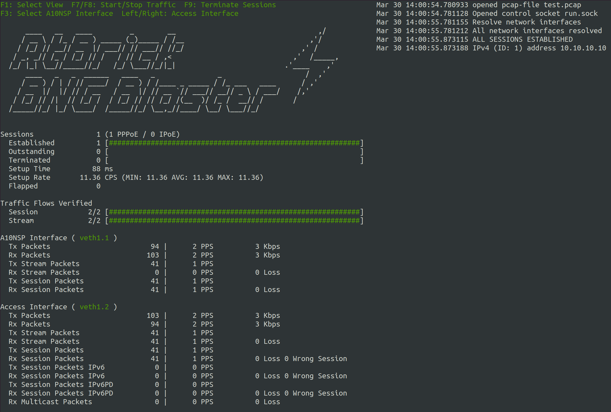

Quickstart Guide
================

In this guide, we’ll walk you through the BNG Blaster basics. All the
examples here work without having network devices to be tested. 

First you need to :ref:`install <install>` the BNG Blaster on your machine.

In the next step, you create a virtual ethernet interface pair that can be 
used by the BNG Blaster to send and received traffic.

.. code-block:: none

    sudo ip link add veth1.1 type veth peer name veth1.2
    sudo ip link set veth1.1 up
    sudo ip link set veth1.2 up

PPPoE
-----

Let's start with a simple PPPoE setup where BNG Blaster emulates the
client and server. On the first interface we use an :ref:`A10NSP interface <a10nsp-interface>`
which includes a lightweight PPPoE server. The other interface is 
configured as PPPoE client. 

The configured :ref:`session traffic <session-traffic>` generates 
bidirectional traffic between client and server. There is also 
one more bound :ref:`traffic stream <streams>` configured.

**pppoe.json:**

.. code-block:: json

    {
        "interfaces": {
            "a10nsp": [
                {
                    "__comment__": "PPPoE Server",
                    "interface": "veth1.1"
                }
            ],
            "access": [
                {
                    "__comment__": "PPPoE",
                    "interface": "veth1.2",
                    "type": "pppoe",
                    "outer-vlan-min": 1,
                    "outer-vlan-max": 4000,
                    "inner-vlan": 7,
                    "stream-group-id": 1
                }
            ]
        },
        "pppoe": {
            "reconnect": true
        },
        "dhcpv6": {
            "enable": false
        },
        "session-traffic": {
            "ipv4-pps": 1
        },
        "streams": [
            {
                "stream-group-id": 1,
                "name": "S1",
                "type": "ipv4",
                "direction": "both",
                "priority": 128,
                "length": 256,
                "pps": 1,
                "a10nsp-interface": "veth1.1"
            }
        ]
    }

Now you can start the BNG Blaster with this configuration.

.. code-block:: none

    $ sudo bngblaster -C pppoe.json
    Mar 30 14:27:59.303904 Resolve network interfaces
    Mar 30 14:27:59.303952 All network interfaces resolved
    Mar 30 14:27:59.396765 ALL SESSIONS ESTABLISHED

After pressing ``ctrl+c`` the test should be stopped and a detailed 
report printed. 

Let's advance the test by enabling some features explained below.

.. code-block:: none
    
    $ sudo bngblaster -C pppoe.json -c 1 -L test.log -l ip -J report.json -j sessions -j streams -P test.pcap -S run.sock -I

* ``-C test.json`` loads the configuration file
* ``-c 1`` defines how many sessions to be emulated, you can increase the number to see what happens...
* ``-L test.log`` creates an optional logging file 
* ``-l ip`` enables the IP address logging
* ``-J report.json`` generates a final JSON report at the end
* ``-j sessions`` include detailed results for every session in the JSON report
* ``-j streams`` include detailed results for every stream in the JSON report
* ``-P test.pcap`` generates a PCAP file
* ``-S run.sock`` opens the JSON RPC API socket
* ``-I`` start interactive courses user interface

Now let's try to press ``F1`` to navigate through the different views. All supported
keyboard inputs are listed in the top left corner. After pressing ``F9`` the test 
should be stopped. 

If the test is still running, you can open a second terminal. Then go to the same 
directory from where you started the BNG Blaster and enter the following command.

.. code-block:: none
    
    $ sudo bngblaster-cli run.sock session-info session-id 1 | jq .

.. code-block:: json

    {
        "status": "ok",
        "code": 200,
        "session-info": {
            "type": "pppoe",
            "session-id": 1,
            "session-state": "Established",
            "interface": "veth1.2",
            "outer-vlan": 1,
            "inner-vlan": 7,
            "mac": "02:00:00:00:00:01",
            "username": "user1@rtbrick.com",
            "reply-message": "BNG-Blaster-A10NSP",
            "lcp-state": "Opened",
            "ipcp-state": "Opened",
            "ip6cp-state": "Opened",
            "ipv4-address": "10.10.10.10",
            "ipv4-dns1": "10.12.12.10",
            "ipv4-dns2": "10.13.13.10",
            "dhcpv6-state": "Init",
            "tx-packets": 87,
            "rx-packets": 80,
            "rx-fragmented-packets": 0,
            "session-traffic": {
                "total-flows": 2,
                "verified-flows": 1,
                "first-seq-rx-access-ipv4": 1,
                "first-seq-rx-access-ipv6": 0,
                "first-seq-rx-access-ipv6pd": 0,
                "first-seq-rx-network-ipv4": 1,
                "first-seq-rx-network-ipv6": 0,
                "first-seq-rx-network-ipv6pd": 0,
                "access-tx-session-packets": 34,
                "access-rx-session-packets": 34,
                "access-rx-session-packets-loss": 0,
                "network-tx-session-packets": 34,
                "network-rx-session-packets": 34,
                "network-rx-session-packets-loss": 0,
                "access-tx-session-packets-ipv6": 0,
                "access-rx-session-packets-ipv6": 0,
                "access-rx-session-packets-ipv6-loss": 0,
                "network-tx-session-packets-ipv6": 0,
                "network-rx-session-packets-ipv6": 0,
                "network-rx-session-packets-ipv6-loss": 0,
                "access-tx-session-packets-ipv6pd": 0,
                "access-rx-session-packets-ipv6pd": 0,
                "access-rx-session-packets-ipv6pd-loss": 0,
                "network-tx-session-packets-ipv6pd": 0,
                "network-rx-session-packets-ipv6pd": 0,
                "network-rx-session-packets-ipv6pd-loss": 0
            },
            "a10nsp": {
                "interface": "veth1.1",
                "s-vlan": 1,
                "qinq-send": false,
                "qinq-received": false,
                "tx-packets": 46,
                "rx-packets": 87
            }
        }
    }

You can also try other :ref:`commands <api>` to get familiar with the API. 

After the test has stopped, you can also check the final JSON report (``jq . report.json``),
log, and PCAP files. 

ISIS
----

In the following example, we create two :ref:`ISIS <isis>` nodes (R1 and R2) with an emulated
ISIS topology attached to R1 (`test.mrt``). 

**isis.json:**

.. code-block:: json

    {
        "interfaces": {
            "network": [
                {
                    "interface": "veth1.1",
                    "address": "10.0.0.1/24",
                    "gateway": "10.0.0.2",
                    "address-ipv6": "fc66:1337:7331::1/64",
                    "gateway-ipv6": "fc66:1337:7331::2",
                    "isis-instance-id": 1,
                    "isis-level": 1
                },
                {
                    "interface": "veth1.2",
                    "address": "10.0.0.2/24",
                    "gateway": "10.0.0.1",
                    "address-ipv6": "fc66:1337:7331::2/64",
                    "gateway-ipv6": "fc66:1337:7331::1",
                    "isis-instance-id": 2,
                    "isis-level": 1
                }
            ]

        },
        "isis": [
            {
                "instance-id": 1,
                "area": [
                    "49.0001/24",
                    "49.0002/24"
                ],
                "system-id": "1921.6800.1001",
                "router-id": "192.168.1.1",
                "hostname": "R1",
                "sr-base": 1000,
                "sr-range": 100,
                "sr-node-sid": 1,
                "level1-auth-key": "secret123",
                "level1-auth-type": "md5",
                "external": {
                    "mrt-file": "test.mrt",
                    "connections": [
                        {
                            "system-id": "1921.6800.0000.00",
                            "l1-metric": 1000,
                            "l2-metric": 2000
                        }
                    ]
                }
            },
            {
                "instance-id": 2,
                "area": [
                    "49.0001/24",
                    "49.0002/24"
                ],
                "system-id": "1921.6800.1002",
                "router-id": "192.168.1.2",
                "hostname": "R2",
                "sr-base": 1000,
                "sr-range": 100,
                "sr-node-sid": 2,
                "level1-auth-key": "secret123",
                "level1-auth-type": "md5"
            }
        ],
        "streams": [
            {
                "name": "RAW1",
                "type": "ipv4",
                "direction": "downstream",
                "priority": 128,
                "destination-ipv4-address": "192.168.1.2",
                "length": 256,
                "pps": 1,
                "network-interface": "veth1.1"
            }
        ]
    }

Now use the included tool ``lspgen`` to generate the attached ISIS topology. 

.. code-block:: none

    $ lspgen -a 49.0001/24 -K secret123 -T md5 -C 1921.6800.1001 -m test.mrt
    Mar 30 14:54:19.647569 Add context for instance default, protocol isis, topology unicast
    Mar 30 14:54:19.647630 Add connector to 0x192168001001
    Mar 30 14:54:19.647633 LSP generation parameters
    Mar 30 14:54:19.647639  Area 49.0001/24
    Mar 30 14:54:19.647642  Level 1, sequence 0x1, lsp-lifetime 65535
    Mar 30 14:54:19.647645  Authentication-key secret123, Authentication-type md5
    Mar 30 14:54:19.647648  IPv4 Node Base Prefix 192.168.0.0/32
    Mar 30 14:54:19.647651  IPv4 Link Base Prefix 172.16.0.0/31
    Mar 30 14:54:19.647654  IPv4 External Base Prefix 10.0.0.0/28
    Mar 30 14:54:19.647657  IPv6 Node Base Prefix fc00::c0a8:0/128
    Mar 30 14:54:19.647660  IPv6 Link Base Prefix fc00::ac10:0/127
    Mar 30 14:54:19.647669  IPv6 External Base Prefix fc00::a00:0/124
    Mar 30 14:54:19.647672  SRGB base 10000, range 2000
    Mar 30 14:54:19.647678 Generating a graph of 10 nodes and 20 links
    Mar 30 14:54:19.647813  Root node 1921.6800.0000.00

Finally, you can start the BNG Blaster. 

.. code-block:: none

    $ sudo bngblaster -C veth1-isis.json -l isis -P test.pcap -S run.sock
    Mar 30 14:56:11.981279 Init IS-IS instance 1
    Mar 30 14:56:11.981314 Load ISIS MRT file test.mrt
    Mar 30 14:56:11.981335 Init IS-IS instance 2
    Mar 30 14:56:12.031917 Add network interface veth1.1 to IS-IS instance 1
    Mar 30 14:56:12.087877 Add network interface veth1.2 to IS-IS instance 2
    Mar 30 14:56:12.087971 opened pcap-file test.pcap
    Mar 30 14:56:12.088013 Opened control socket run.sock
    Mar 30 14:56:13.088035 Resolve network interfaces
    Mar 30 14:56:13.088050 All network interfaces resolved
    Mar 30 14:56:22.093906 ISIS L1 adjacency UP on interface veth1.2 
    Mar 30 14:56:22.093964 ISIS L1 adjacency UP on interface veth1.1 

If the test is still running, you can open a second terminal, go to the same directory
from where you started the BNG Blaster and enter the following command. 

.. code-block:: none
    
    $ sudo bngblaster-cli run.sock isis-adjacencies

.. code-block:: json

    {
        "status": "ok",
        "code": 200,
        "isis-adjacencies": [
            {
                "interface": "veth1.1",
                "type": "P2P",
                "level": "L1",
                "instance-id": 1,
                "adjacency-state": "Up",
                "peer": {
                    "system-id": "1921.6800.1002"
                }
            },
            {
                "interface": "veth1.2",
                "type": "P2P",
                "level": "L1",
                "instance-id": 2,
                "adjacency-state": "Up",
                "peer": {
                    "system-id": "1921.6800.1001"
                }
            }
        ]
    }

You can also try other :ref:`commands <api>` to get familiar with the API.