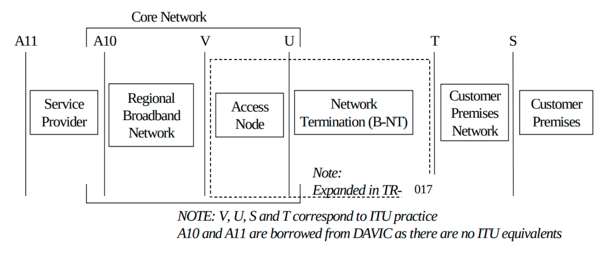

.. _l2bsa:

L2BSA
-----

Layer 2 Bitstream Access (L2BSA) refers to a scenario in which a service provider makes 
his access infrastructure available to other service providers. These are retail service 
providers who provide their Internet services. In Germany, this service is mandated by 
the Federal Network Agency (German: Bundesnetzagentur or BNetzA). This is the regulatory 
office for electricity, gas, telecommunications, post, and railway markets. It is a federal 
agency of the Federal Ministry for Economic Affairs and Energy located in Bonn, Germany.

The definition of L2BSA service was defined by the so-called 
`NGA Forum <https://www.bundesnetzagentur.de/EN/Areas/Telecommunications/Companies/MarketRegulation/NGAForum/NGAForum_node.html>`_. 
This is an advisory board founded in May 2010 by the Bundesnetzagentur for promoting dialogue 
between the Bundesnetzagentur, network operators, manufacturers, states, and local authorities 
on NGA rollout.

The L2BSA specification defines two interfaces. The so-called U interface (User Interface) 
at the customer location and the A10-NSP interface (A10 Network Service Provider) between 
the service provider networks. Those interface types were introduced in the Broadband Forum 
TR-101 (Migration to Ethernet-Based Broadband Aggregation).

.. image:: ../images/bbl_l2bsa_interfaces.png
    :alt: L2BSA Interfaces

The U interface is defined as a transparent Layer 2 interface. This can be used with or without 
VLAN tags by the wholesale service providers. This means that some CPE will send their traffic 
untagged while another CPE is configured for tagged traffic. All those traffic needs to be forwarded 
between the U interface and the A10-NSP interface.

The A10-NSP interface is defined as a link aggregation bundle interface with one or more interfaces 
and LACP enabled or disabled. All traffic on this interface is at least single-tagged with the so-called 
S-VLAN tag which identifies the U interface. This limits the amount of L2BSA services to 4094 per A10-NSP 
interface caused by the usable VLAN range. So some providers need many A10-NSP interfaces if they need to 
address more than the 4094 services.

The term A10 relates to the end-to-end ADSL network reference model depicted in the figure below. 
The Core Network reference model is a subset of the end-to-end architecture. It is composed of two 
functional blocks and three reference points. The Access Node and the Regional Broadband Network are 
the two functional blocks. U, V, and A10 are the three reference points.

The mapping between the U interface and A10-NSP/S-VLAN is managed by the L2BSA service provider. 
These mappings may change triggered by re-provisioning actions (port up/down). 

Thus all PPPoE discovery, as well as DHCPv4/v6 packets, must be enriched with extra line identification 
headers (Agent-Remote-Id, Agent-Circuit-Id, Actual-Data-Rate, …​) by the L2BSA service provider in the 
upstream direction (from U to A10-NSP interface). Those headers allow the wholesale provider to identify 
the actual U interface for traffic received on the A10-NSP interface. This functionality is referred to 
as the intermediate agent functionality.

The BNG Blaster A10NSP interface emulates such a layer two provider interface. This interface type accepts 
all DHCPv4 and PPPoE sessions were received to verify forwarding and header enrichment.

Following a basic PPPoE/A10NSP configuration example which is
detailed explained in the configuration section.

.. code-block:: json

    {
        "interfaces": {
            "a10nsp": [
                {
                    "interface": "eth4",
                    "qinq": true,
                    "mac": "02:00:00:ff:ff:01"
                },
                {
                    "interface": "eth5",
                    "qinq": true,
                    "mac": "02:00:00:ff:ff:01"
                }
            ],
            "access": [
                {
                    "__comment__": "PPPoE",
                    "interface": "eth1",
                    "type": "pppoe",
                    "outer-vlan-min": 1,
                    "outer-vlan-max": 4000,
                    "inner-vlan": 7,
                    "stream-group-id": 1,
                    "a10nsp-interface": "eth4"
                }
            ]
        },
        "pppoe": {
            "reconnect": true,
            "discovery-timeout": 3,
            "discovery-retry": 10,
            "host-uniq": true,
            "vlan-priority": 6
        },
        "dhcpv6": {
            "enable": false
        },
        "session-traffic": {
            "autostart": true,
            "ipv4-pps": 10
        },
        "streams": [
            {
                "stream-group-id": 2,
                "name": "PPPOE-S1",
                "type": "ipv4",
                "direction": "both",
                "priority": 128,
                "length": 256,
                "pps": 10,
                "a10nsp-interface": "eth4"
            },
            {
                "stream-group-id": 2,
                "name": "PPPOE-S2",
                "type": "ipv4",
                "direction": "both",
                "priority": 128,
                "length": 256,
                "pps": 10,
                "a10nsp-interface": "eth5"
            }
        ]
    }

You can define multiple interfaces with the same MAC
address to emulate some static link aggregation (without LACP)
or directly use :ref:`Link Aggregation (LAG) <lag-interface>` 
interfaces as the parent interface for the A10-NSP interface function.
Using static link aggregation allows to manually define the sending 
interface for every stream (``"a10nsp-interface": "<interface"``) 
where LAG interfaces automatically balance streams over the member 
interfaces. It also allows using TX threads for those interfaces 
which is not supported for LAG interfaces.

It is recommended to manually specify the corresponding 
a10nsp-interface in the access interface function, otherwise the 
first found a10nsp interface function is used.
This interface is used for corresponding traffic streams 
where the a10nsp-interface is not explicitly defined, including
the autogenerated :ref:`session traffic <session-traffic>`. 

L2BSA over Network Inerfaces
~~~~~~~~~~~~~~~~~~~~~~~~~~~~

This experimental feature enables the termination of MPLS-encapsulated 
L2BSA services through network interfaces. It requires that L2BSA services 
utilize the same service label for both ingress and egress traffic, and the 
transport label for downstream traffic must be manually configured. 

This feature enables the emulation of an entire A10NSP switch through 
network interfaces.

.. code-block:: json

    {
        "interfaces": {
            "network": [
                {
                    "interface": "eth2",
                    "address-ipv6": "fc66:1337:7331:8::10",
                    "gateway-ipv6": "fc66:1337:7331:8::1",
                    "a10nsp": true,
                    "a10nsp-tx-label": 13370
                }
            ],
            "access": [
                {
                    "__comment__": "PPPoE",
                    "interface": "eth1",
                    "type": "pppoe",
                    "outer-vlan-min": 1,
                    "outer-vlan-max": 4000,
                    "inner-vlan": 7,
                    "stream-group-id": 1,
                    "a10nsp-interface": "eth2"
                }
            ]
        },
        "streams": [
            {
                "name": "P0",
                "stream-group-id": 1,
                "type": "ipv4",
                "direction": "both",
                "pps": 1,
                "a10nsp-interface": "eth2",
                "destination-ipv4-address": "10.0.0.0"
            }
        ],
        "bgp": [
            {
                "network-interface": "eth2",
                "local-ipv6-address": "fc66:1337:7331:8::10",
                "peer-ipv6-address": "fc66:1337:7331:8::1",
                "raw-update-file": "a10nsp.bgp",
                "local-as": 4200000001,
                "peer-as": 4200000002
            }
        ]
    }