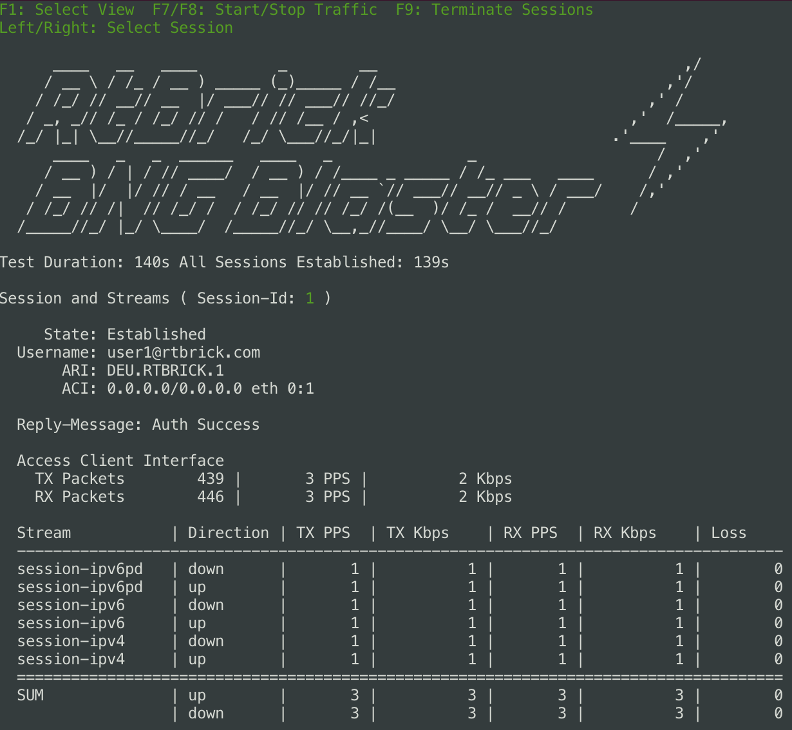

.. _session-traffic:

Session Traffic
---------------

The BNG Blaster can autogenerate bidirectional unicast
session traffic for all addresses assigned to a session
(IPv4, IPv6 and IPv6PD) and the corresponding network 
interface function. 

.. image:: ../images/bbl_session_traffic.png
    :alt: Session Traffic

This is a powerful tool to quickly verify that forwarding
is correctly set up and working. 

.. note::

    All traffic sent from a network or a10nsp interfaces function 
    is called downstream. All traffic sent from an access interface
    function is called upstream. 

Those autogenerated traffic streams are named
``session-ipv4``, ``session-ipv6`` and ``session-ipv6pd``.

Configuration
~~~~~~~~~~~~~

The following example shows how to enable session traffic. 

.. code-block:: json

    {
        "session-traffic": {
            "ipv4-pps": 1,
            "ipv6-pps": 1,
            "ipv6pd-pps": 1
        }
    }

.. include:: ../configuration/session_traffic.rst

This traffic is generated between the session and a network 
interface. In case of multiple network interfaces, the preferred
network interfaces can be selected using the ``network-interface`` 
option in the corresponding access configuration. 

Verification
~~~~~~~~~~~~

The final report includes detailed information 
for session traffic. 

.. code-block:: none 

    Session Traffic (Global):
    ------------------------------------------------------------------------------
      Config:
        PPS IPv4:                    1
        PPS IPv6:                    1
        PPS IPv6PD:                  1
      Verified Traffic Flows:    96000/96000 (100.00%)
        Downstream IPv4:         16000
        Downstream IPv6:         16000
        Downstream IPv6PD:       16000
        Upstream IPv4:           16000
        Upstream IPv6:           16000
        Upstream IPv6PD:         16000
      Violations:               >1s             >1s-2s   >2s-3s      >3s
        Downstream IPv4:      12278 ( 12.79%)     3071     3040     6167
        Downstream IPv6:      12252 ( 12.76%)     3185     2900     6167
        Downstream IPv6PD:    12306 ( 12.82%)     3123     2978     6205
        Upstream IPv4:        12314 ( 12.83%)     3104     3033     6177
        Upstream IPv6:        12252 ( 12.76%)     3184     2891     6177
        Upstream IPv6PD:      12361 ( 12.88%)     3178     2957     6226
        Total:                73763 ( 76.84%)    18845    17799    37119
      First Sequence Received:  MIN                AVG               MAX
        Downstream IPv4           1 ( 1.00s)         9 ( 9.00s)       64 (64.00s)
        Downstream IPv6           1 ( 1.00s)         9 ( 9.00s)       64 (64.00s)
        Downstream IPv6PD         1 ( 1.00s)         9 ( 9.00s)       64 (64.00s)
        Upstream IPv4             1 ( 1.00s)         9 ( 9.00s)       64 (64.00s)
        Upstream IPv6             1 ( 1.00s)         9 ( 9.00s)       64 (64.00s)
        Upstream IPv6PD           1 ( 1.00s)         9 ( 9.00s)       64 (64.00s)

The ``First Sequence Number Received`` is used to measure the forwarding 
convergence. The session traffic starts automatically as soon as the session
is established using the rate configured. All traffic flows in the BNG Blaster
start with the 64bit sequence number 1. Assuming the first sequence number 
received for a given flow is 5 and the configured rate is 1 PPS, this would 
mean that it took between 4 and 5 seconds until forwarding is working.