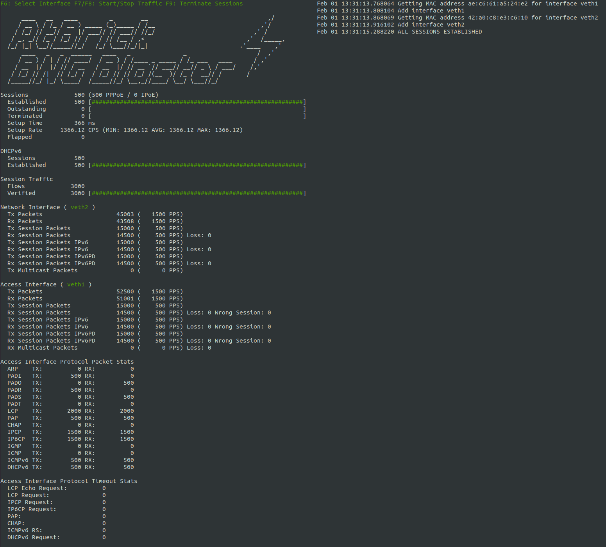

BNG Blaster
===========

The **BNG Blaster** is an open-source network tester 
for access and routing protocols. It can emulate massive 
PPPoE and IPoE (DHCP) subscribers including IPTV, and L2TP (LNS). 
There are various routing protocols supported like ISIS and BGP. 
So you can use it for end-to-end BNG and non-BNG router testing.

You can use the included traffic generator for forwarding verification,
QoS testing or to measure convergence times. The traffic generator supports 
millions of separate tracked flows. This allows you to verify every single 
forwarding state of a full-feed internet routing table. You can also send 
traffic to every single QoS queue of your service edge router.

The BNG Blaster is used by leading network operators, network hard- and software vendors.

.. tabs::

   .. tab:: Modern Software

        * Emulate massive nodes and sessions with low CPU and memory footprint
        * Runs on every modern Linux, virtual machine and containers
        * All protocols implemented in user space and optimized for performance
        * Automation-friendly API
        * ...

   .. tab:: Access Protocols

        * Emulate massive PPPoE and IPoE (DHCP) clients
        * Emulate L2TPv2 LNS servers with different behaviors
        * Emulate A10NSP interfaces for L2BSA testing
        * Included multicast and IPTV test suite
        * Verify legal interception (LI) traffic
        * ...

   .. tab:: Routing Protocols

        * Emulate ISIS topologies with thousands of nodes 
        * Support for ISIS Segment Routing
        * Setup thousands of BGP sessions with millions of prefixes
        * Verify MPLS labels for millions of flows
        * ...

   .. tab:: Traffic Generator

        * Generate and track millions of traffic flows
        * Verify your QoS configuration 
        * Verify all forwarding states
        * Measure convergence times and loss
        * ...

A short `introduction <https://youtu.be/EHJ70p0_Sw0>`_ and good presentation
from `DENOG13 <https://youtu.be/LVg6rlVEfNU>`_ can be found on YouTube. 

Contents
--------

.. toctree::
   :maxdepth: 1

   install
   quickstart
   interfaces
   access/index
   routing/index
   streams
   reports
   configuration/index
   api/index
   controller
   troubleshooting
   reference/index
   faq

Sources
-------

https://github.com/rtbrick/bngblaster

License
-------

BNG Blaster is licensed under the BSD 3-Clause License, which means that you are free to get and use it for
commercial and non-commercial purposes as long as you fulfill its conditions.

See the `LICENSE <https://github.com/rtbrick/bngblaster/blob/main/LICENSE>`_ 
file for more details.

Copyright
---------
.. |copy|   unicode:: U+000A9 .. COPYRIGHT SIGN

Copyright |copy| 2020-2022, RtBrick, Inc.

Contact
-------

bngblaster@rtbrick.com