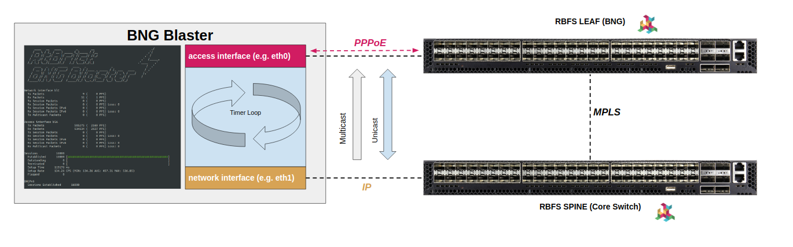

.. _interfaces:

Interfaces
==========

The BNG Blaster distinguishes between interface links and interface functions.
An interface link can be considered as the actual interface with all the 
corresponding IO settings. This is similar but not the same as physical interfaces
in typical router implementations. Interface functions are similar to logical interfaces 
and define the actual services. One or more interface functions can be attached to each 
interface link.

At least one interface function is required to start the BNG Blaster.

Operating System Settings
-------------------------

The BNG Blaster implements all protocols in user space. Therefore the used interfaces 
links must not have an IP address configured in the host operating system, to prevent that 
the received packets are handled or even responded to from the Linux kernel as well.

All used interface links must be in an operational state up.

.. code-block:: none

    sudo ip link set dev <interface> up

It is not possible to send packets larger than the configured interface MTU, which is 1500 
bytes per default. For PPPoE with multiple VLAN headers, this might be not enough for large 
packets. Therefore the interface MTU should be increased using the following commands.

.. code-block:: none
    
    sudo ip link set mtu 9000 dev <interface>

All this can be also archived via netplan using the following configuration for each BNG Blaster
interface link.

.. code-block:: yaml

    network:
    version: 2
    renderer: networkd
    ethernets:
      eth1:
        dhcp4: no
        dhcp6: no
        link-local: []
        mtu: 9000
      eth2:
        dhcp4: no
        dhcp6: no
        link-local: []
        mtu: 9000

It might be also needed to increase the hardware and software queue size of your
network interface links for higher throughput. 

The command ``ethtool -g <interface>`` shows the currently applied and maximum 
hardware queue size.

.. code-block:: none

    $ sudo ethtool -g ens5f1
    Ring parameters for ens5f1:
    Pre-set maximums:
    RX:             4096
    RX Mini:        0
    RX Jumbo:       0
    TX:             4096
    Current hardware settings:
    RX:             512
    RX Mini:        0
    RX Jumbo:       0
    TX:             512

The currently applied settings can be changed with the following command: 

.. code-block:: none

    sudo ethtool -G ens5f1 tx 4096 rx 4096

You can even change the software queue size:

.. code-block:: none

    sudo ip link set txqueuelen 4096 dev ens5f1

Interface Settings
------------------

The interfaces section contains all configurations around interface links and options. 

.. include:: configuration/interfaces.rst

.. code-block:: json

    {
        "interfaces": {
            "tx-interval": 0.1,
            "rx-interval": 0.1,
            "io-slots": 4096,
        }
    }

Links
~~~~~

.. _links:

The link configuration is optional and allows to define per interface link configurations. An explicit
link configuration with the global default settings is automatically generated if no link is defined
for interface links referenced by interface functions. 

.. include:: configuration/interfaces_links.rst

.. code-block:: json

    {
        "interfaces": {
            "tx-interval": 0.1,
            "rx-interval": 0.1,
            "io-slots": 4096,
        }
    }

.. _lag-interface:

Link Aggregation (LAG)
~~~~~~~~~~~~~~~~~~~~~~

The BNG Blaster supports link aggregation (LAG) with and without 
LACP. The created LAG interface can be used as the parent interface link 
for all kinds of interface functions. 

.. include:: configuration/interfaces_lag.rst

.. code-block:: json

    {
        "interfaces": {
            "lag": [
                {
                    "interface": "lag1",
                    "lacp": true,
                    "lacp-timeout-short": true
                }
            ],
            "links": [
                {
                    "interface": "eth1",
                    "lag-interface": "lag1"
                },
                {
                    "interface": "eth1",
                    "lag-interface": "lag1"
                }
            ],
            "network": [
                {
                    "interface": "lag1", 
                    "address": "10.100.0.2/24",
                    "gateway": "10.100.0.1"
                }
            ]
        }
    }

.. _io-modes:

Interface Functions
-------------------

The BNG Blaster supports three types of interface functions, 
``network``, ``access``, and ``a10nsp``. 

.. _network-interface:

Network Interfaces
~~~~~~~~~~~~~~~~~~

The network interfaces are used to emulate the core-facing side of the internet 
with optional routing protocols and traffic. 

Those interfaces can communicate with the configured gateway only.
Meaning that all traffic sent from the network interface will be sent 
to the learned MAC address of the configured gateway. 

The network interface behaves like a router. It accepts all traffic sent 
to its own MAC address. This allows sending and receiving traffic for prefixes 
advertised via routing protocols or configured via static routes on the 
connected device under test.

The network interfaces are also used to inject downstream multicast test traffic 
for IPTV tests. It is also possible to send RAW traffic streams between network
interfaces without any access interface defined for non-BNG testing.

The BNG Blaster responds to all ICMP echo requests sent to its own MAC address. 

.. include:: configuration/interfaces_network.rst

The BNG Blaster supports multiple network interfaces
as shown in the example below.

.. code-block:: json

    {
        "interfaces": {
            "tx-interval": 1,
            "rx-interval": 1,
            "io-slots": 4096,
            "network": [
                {
                    "interface": "eth2",
                    "address": "10.0.0.1/24",
                    "gateway": "10.0.0.2",
                    "address-ipv6": "fc66:1337:7331::1/64",
                    "gateway-ipv6": "fc66:1337:7331::2"
                },
                {
                    "interface": "eth3",
                    "address": "10.0.1.1/24",
                    "gateway": "10.0.1.2",
                    "address-ipv6": "fc66:1337:7331:1::1/64",
                    "gateway-ipv6": "fc66:1337:7331:1::2"
                }
            ],
        }
    }

Using multiple network interfaces requires selecting which network interface
to be used. If not explicitly configured, one of the interfaces is selected 
automatically. Therefore, the configuration option ``network-interface`` 
is supported in different sections.

It is also supported to have multiple VLAN-tagged network interfaces on the 
same interface link. 

VLAN-tagged network interfaces must be referenced by ``<interface>:<vlan>``
in the configuration to distinguish between them. 

.. code-block:: json

    {
        "interfaces": {
            "network": [
                {
                    "interface": "eth1", 
                    "address": "10.100.0.2/24",
                    "gateway": "10.100.0.1",
                    "vlan": 100
                },
                {
                    "interface": "eth1",
                    "address": "10.200.0.2/24",
                    "gateway": "10.200.0.1",
                    "vlan": 200
                }
            ]
        },
        "streams": [
            {
                "name": "S100",
                "type": "ipv4",
                "pps": 10,
                "network-interface": "eth1:100",
                "destination-ipv4-address": "10.200.0.2"
            },
            {
                "name": "S200",
                "type": "ipv4",
                "pps": 20,
                "network-interface": "eth1:200",
                "destination-ipv4-address": "10.100.0.2"
            }
        ]
    }

.. _access-interface:

Access Interfaces
~~~~~~~~~~~~~~~~~

The access interfaces are used to emulate PPPoE and IPoE clients.

.. include:: configuration/interfaces_access.rst

For all modes, it is possible to configure between zero and three VLAN
tags on the access interface. The VLAN identifier ``0`` disables the
corresponding VLAN header. 

.. code-block:: none

    [ethernet][outer-vlan][inner-vlan][third-vlan][pppoe]...

Untagged
""""""""
.. code-block:: json

    {
        "access": {
            "interface": "eth1",
            "outer-vlan-min": 0,
            "outer-vlan-max": 0,
            "inner-vlan-min": 0,
            "inner-vlan-max": 0
        }
    }

Single Tagged
"""""""""""""
.. code-block:: json

    {
        "access": {
            "interface": "eth1",
            "outer-vlan-min": 1,
            "outer-vlan-max": 4049,
            "inner-vlan-min": 0,
            "inner-vlan-max": 0
        }
    }

Double Tagged
"""""""""""""
.. code-block:: json

    {
        "access": {
            "interface": "eth1",
            "outer-vlan-min": 1,
            "outer-vlan-max": 4049,
            "inner-vlan-min": 7,
            "inner-vlan-max": 7
        }
    }

Triple Tagged
"""""""""""""
.. code-block:: json

    {
        "access": {
            "interface": "eth1",
            "outer-vlan-min": 10,
            "outer-vlan-max": 20,
            "inner-vlan-min": 128,
            "inner-vlan-max": 4000,
            "third-vlan": 7
        }
    }

The BNG Blaster supports also multiple access interfaces
or VLAN ranges as shown in the example below.

.. code-block:: json

    {
        "access": [
            {
                "interface": "eth1",
                "type": "pppoe",
                "session-group-id": 1,
                "username": "pta@rtbrick.com",
                "outer-vlan-min": 1000,
                "outer-vlan-max": 1999,
                "inner-vlan-min": 7,
                "inner-vlan-max": 7
            },
            {
                "interface": "eth1",
                "type": "pppoe",
                "session-group-id": 2,
                "username": "l2tp@rtbrick.com",
                "outer-vlan-min": 2000,
                "outer-vlan-max": 2999,
                "inner-vlan-min": 7,
                "inner-vlan-max": 7
            },
            {
                "interface": "eth3",
                "type": "pppoe",
                "session-group-id": 1,
                "username": "test@rtbrick.com",
                "outer-vlan-min": 128,
                "outer-vlan-max": 4000,
                "inner-vlan-min": 7,
                "inner-vlan-max": 7
            },
            {
                "interface": "eth4",
                "type": "ipoe",
                "session-group-id": 3,
                "outer-vlan-min": 8,
                "outer-vlan-max": 9,
                "address": "200.0.0.1",
                "address-iter": "0.0.0.4",
                "gateway": "200.0.0.2",
                "gateway-iter": "0.0.0.4"
            }
        ]
    }

The configuration attributes for username, password, agent-remote-id, agent-circuit-id,
and cfm-ma-name support variable substitution. The variable ``{session-global}`` will
be replaced with the actual session-id starting from 1 and incremented for every 
new session. The variable ``{session}`` is incremented per-interface section. The
variables ``{outer-vlan}`` and ``{inner-vlan}`` will be replaced with the corresponding
VLAN identifier or 0 if not defined. The two variables ``{i1}`` and ``{i2}`` are 
configurable per-interface sections with user-defined start values and steps. 

The BNG Blaster supports the VLAN mode ``1:1`` (default) and ``N:1``. The first one
assigns a dedicated VLAN per subscriber. The VLAN mode ``N:1`` assigns one VLAN to N 
subscribers and therefore only one VLAN combination is supported per access interface 
section using this mode.

.. code-block:: json

    {
        "access": [
            {
                "interface": "eth1",
                "type": "pppoe",
                "vlan-mode": "N:1",
                "username": "test@rtbrick.com",
                "outer-vlan": 7
            },
            {
                "interface": "eth2",
                "type": "pppoe",
                "vlan-mode": "N:1",
                "username": "test@rtbrick.com",
                "outer-vlan": 2000,
                "inner-vlan": 7,
            },
        ]
    }

One or more access interface blocks can be grouped using the ``session-group-id``, 
which allows applying some commands like `session-start`, `session-stop` or 
`session-restart` to all sessions belonging to the same group. The example
below shows how to assign all even VLAN identifiers to session group 1 and
all odd VLAN identifiers to session group 2.

.. code-block:: json

    {
        "access": [
            {
                "interface": "eth1",
                "type": "pppoe",
                "session-group-id": 1,
                "username": "even@rtbrick.com",
                "outer-vlan-min": 1000,
                "outer-vlan-max": 1998,
                "outer-vlan-step": 2,
                "inner-vlan": 7
            },
            {
                "interface": "eth1",
                "type": "pppoe",
                "session-group-id": 2,
                "username": "odd@rtbrick.com",
                "outer-vlan-min": 1001,
                "outer-vlan-max": 1999,
                "outer-vlan-step": 2,
                "inner-vlan": 7
            },
        ]
    }

The BNG Blaster supports access and network interface functions on the same
interface link if both are tagged with disjoint VLAN ranges. 

.. _a10nsp-interface:

A10NSP Interfaces
~~~~~~~~~~~~~~~~~

The A10NSP interface function is required for :ref:`L2BSA <l2bsa>` tests and
emulates a layer two provider interface. The term A10 refers to the end-to-end 
ADSL network reference model from TR-025. 

.. include:: configuration/interfaces_a10nsp.rst

The BNG Blaster supports multiple A10NSP interfaces
as shown in the example below.

.. code-block:: json

    {
        "interfaces": {
            "tx-interval": 1,
            "rx-interval": 1,
            "a10nsp": [
                {
                    "interface": "eth4",
                    "qinq": true,
                    "mac": "02:00:00:ff:ff:01"
                },
                {
                    "interface": "eth5",
                    "qinq": false,
                    "mac": "02:00:00:ff:ff:02"
                }
            ],
        }
    }

.. note::

    The A10NSP interface function can't reside on the same link with
    with network or access interface functions!

I/O Modes
---------

The BNG Blaster supports many configurable I/O modes listed with ``bngblaster -v``. 
In the default mode ``packet_mmap_raw``, all packets are received in a Packet MMAP
ring buffer and sent through RAW packet sockets.

.. code-block:: none

    $ bngblaster -v
    Version: 0.8.1
    Compiler: GNU (7.5.0)
    IO Modes: packet_mmap_raw (default), packet_mmap, raw

Packet MMAP
~~~~~~~~~~~

`Packet MMAP <https://www.kernel.org/doc/html/latest/networking/packet_mmap.html>`_ 
is a so-called PACKET_RX_RING/PACKET_TX_RING abstraction where a user-space 
program gets a fast lane into reading and writing to kernel interfaces using a shared 
ring buffer. The shared ring buffer is a memory-mapped window shared between the kernel 
and the user space. This low overhead abstraction allows us to transmit and receive 
traffic without doing expensive system calls. Sending and transmitting traffic via 
Packet MMAP is as easy as copying a packet into a buffer and setting a flag.

RAW
~~~

`RAW Packet Sockets <https://man7.org/linux/man-pages/man7/packet.7.html>`_. 
are used to receive or send raw packets at the device driver (OSI Layer 2) level.

.. _dpdk-interface:

DPDK
~~~~

Using the experimental `DPDK <https://www.dpdk.org/>`_ support requires building 
the BNG Blaster from sources with DPDK enabled as explained 
in the corresponding :ref:`installation <install-dpdk>` section. 

.. note::

    The official BNG Blaster Debian release packages do not support 
    `DPDK <https://www.dpdk.org/>`_!

.. code-block:: json

    {
        "interfaces": {
            "tx-interval": 0.1,
            "links": [
                {
                    "interface": "0000:23:00.0",
                    "io-mode": "dpdk",
                    "rx-threads": 4,
                    "rx-cpuset": [4,5,6,7],
                    "tx-threads": 3,
                    "tx-cpuset": [1,2,3]
                },
                {
                    "interface": "0000:23:00.2",
                    "io-mode": "dpdk",
                    "rx-threads": 4,
                    "rx-cpuset": [12,13,14,15],
                    "tx-threads": 3,
                    "tx-cpuset": [9,10,11]
                }
            ],
            "a10nsp": [
                {
                    "__comment__": "PPPoE Server",
                    "interface": "0000:23:00.0"
                }
            ],
            "access": [
                {
                    "__comment__": "PPPoE Client",
                    "interface": "0000:23:00.2",
                    "type": "pppoe",
                    "outer-vlan-min": 1,
                    "outer-vlan-max": 4000,
                    "inner-vlan-min": 1,
                    "inner-vlan-max": 4000,
                    "stream-group-id": 1
                }
            ]
        },
        "pppoe": {
            "reconnect": true
        },
        "dhcpv6": {
            "enable": false
        },
        "streams": [
            {
                "stream-group-id": 1,
                "name": "S1",
                "type": "ipv4",
                "direction": "both",
                "pps": 1000,
                "a10nsp-interface": "0000:23:00.0"
            }
        ]
    }