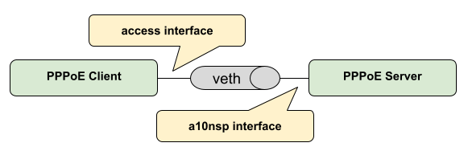
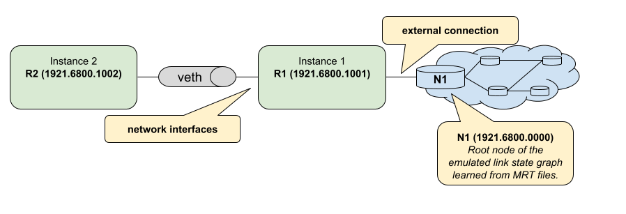

Quickstart Guide
================

In this guide, we’ll walk you through the BNG Blaster basics. All the 
examples here work standalone without having network devices.

First, you need to :ref:`install <install>` the BNG Blaster on your machine.

In the next step, you create a virtual ethernet interface pair. This can be 
used by the BNG Blaster to send and receive traffic.

.. code-block:: none

    sudo ip link add veth1.1 type veth peer name veth1.2
    sudo ip link set veth1.1 up
    sudo ip link set veth1.2 up

PPPoE
-----

Let's start with a simple PPPoE setup where BNG Blaster emulates the
client and server. On the first interface we use an 
:ref:`A10NSP interface <a10nsp-interface>`. Those interfaces emulate a 
lightweight PPPoE server by accepting every session. The other interface is 
configured as PPPoE client. 

The configured :ref:`session traffic <session-traffic>` generates 
bidirectional traffic between client and server. There is also 
one more :ref:`traffic stream <streams>` bound to the sessions.

**pppoe.json:**

.. code-block:: json

    {
        "interfaces": {
            "a10nsp": [
                {
                    "__comment__": "PPPoE Server",
                    "interface": "veth1.1"
                }
            ],
            "access": [
                {
                    "__comment__": "PPPoE Client",
                    "interface": "veth1.2",
                    "type": "pppoe",
                    "outer-vlan-min": 1,
                    "outer-vlan-max": 4000,
                    "inner-vlan": 7,
                    "stream-group-id": 1
                }
            ]
        },
        "pppoe": {
            "reconnect": true
        },
        "dhcpv6": {
            "enable": false
        },
        "session-traffic": {
            "ipv4-pps": 1
        },
        "streams": [
            {
                "stream-group-id": 1,
                "name": "S1",
                "type": "ipv4",
                "direction": "both",
                "priority": 128,
                "length": 256,
                "pps": 1,
                "a10nsp-interface": "veth1.1"
            }
        ]
    }

Now you can start the BNG Blaster with this configuration.

.. code-block:: none

    $ sudo bngblaster -C pppoe.json
    Mar 30 14:27:59.303904 Resolve network interfaces
    Mar 30 14:27:59.303952 All network interfaces resolved
    Mar 30 14:27:59.396765 ALL SESSIONS ESTABLISHED

After pressing ``ctrl+c``, the test should be stopped and a detailed 
report printed. 

Let's advance the test by enabling some features explained below.

.. code-block:: none
    
    $ sudo bngblaster -C pppoe.json -c 1 -L test.log -l ip -J report.json -j sessions -j streams -P test.pcap -S run.sock -I

* ``-C test.json`` loads the configuration file
* ``-c 1`` defines how many sessions to be emulated, you can increase the number to see what happens...
* ``-L test.log`` creates an optional logging file 
* ``-l ip`` enables the IP address logging
* ``-J report.json`` generates a final JSON report at the end
* ``-j sessions`` include detailed results for every session in the JSON report
* ``-j streams`` include detailed results for every stream in the JSON report
* ``-P test.pcap`` generates a PCAP file
* ``-S run.sock`` opens the JSON RPC API socket
* ``-I`` start interactive courses user interface

.. image:: images/quickstart_interactive.png
    :alt: BNG Blaster Interactive

Now let's try to press ``F1`` to navigate through the different views. All supported
keyboard inputs are listed in the top left corner. After pressing ``F9`` the test 
should be stopped. 

.. image:: images/quickstart_streams.png
    :alt: BNG Blaster Interactive

If the test is still running, you can open a second terminal. Then go to the same 
directory from where you started the BNG Blaster and enter the following command.

.. code-block:: none
    
    $ sudo bngblaster-cli run.sock session-info session-id 1 | jq .

.. code-block:: json

    {
        "status": "ok",
        "code": 200,
        "session-info": {
            "type": "pppoe",
            "session-id": 1,
            "session-state": "Established",
            "interface": "veth1.2",
            "outer-vlan": 1,
            "inner-vlan": 7,
            "mac": "02:00:00:00:00:01",
            "username": "user1@rtbrick.com",
            "reply-message": "BNG-Blaster-A10NSP",
            "lcp-state": "Opened",
            "ipcp-state": "Opened",
            "ip6cp-state": "Opened",
            "ipv4-address": "10.10.10.10",
            "ipv4-dns1": "10.12.12.10",
            "ipv4-dns2": "10.13.13.10",
            "dhcpv6-state": "Init",
            "tx-packets": 38,
            "rx-packets": 35,
            "rx-fragmented-packets": 0,
            "session-traffic": {
                "total-flows": 2,
                "verified-flows": 2,
                "downstream-ipv4-flow-id": 2,
                "downstream-ipv4-tx-packets": 13,
                "downstream-ipv4-rx-packets": 13,
                "downstream-ipv4-rx-first-seq": 1,
                "downstream-ipv4-loss": 0,
                "downstream-ipv4-wrong-session": 0,
                "upstream-ipv4-flow-id": 1,
                "upstream-ipv4-tx-packets": 13,
                "upstream-ipv4-rx-packets": 13,
                "upstream-ipv4-rx-first-seq": 1,
                "upstream-ipv4-loss": 0,
                "upstream-ipv4-wrong-session": 0
            },
            "a10nsp": {
                "interface": "veth1.1",
                "s-vlan": 1,
                "qinq-send": false,
                "qinq-received": false,
                "tx-packets": 35,
                "rx-packets": 38
            }
        }
    }

You can also try other :ref:`commands <api>` to get familiar with the API. 

After the test has stopped, you can also check the final JSON report (``jq . report.json``),
log, and PCAP files. 

DHCP
----

Let's repeat all the steps from the PPPoE example before but with the following
IPoE DHCP configuration.

**dhcp.json:**

.. code-block:: json

    {
        "interfaces": {
            "a10nsp": [
                {
                    "__comment__": "DHCP Server",
                    "interface": "veth1.1"
                }
            ],
            "access": [
                {
                    "__comment__": "DHCP Client",
                    "interface": "veth1.2",
                    "type": "ipoe",
                    "ipv6": false,
                    "outer-vlan-min": 1,
                    "outer-vlan-max": 4000,
                    "inner-vlan": 7,
                    "stream-group-id": 1
                }
            ]
        },
        "access-line": {
            "agent-remote-id": "DEU.RTBRICK.{session-global}",
            "agent-circuit-id": "0.0.0.0/0.0.0.0 eth 0:{session-global}"
        },
        "dhcp": {
            "enable": true,
            "broadcast": false
        },
        "session-traffic": {
            "ipv4-pps": 1
        },
        "streams": [
            {
                "stream-group-id": 1,
                "name": "S1",
                "type": "ipv4",
                "direction": "both",
                "priority": 128,
                "length": 256,
                "pps": 1,
                "a10nsp-interface": "veth1.1"
            }
        ]
    }

ISIS
----

In the following example, we create two :ref:`ISIS <isis>` nodes (R1 and R2) with an emulated
ISIS topology attached to R1 (`test.mrt``). 

**isis.json:**

.. code-block:: json

    {
        "interfaces": {
            "network": [
                {
                    "interface": "veth1.1",
                    "address": "10.0.0.1/24",
                    "gateway": "10.0.0.2",
                    "address-ipv6": "fc66:1337:7331::1/64",
                    "gateway-ipv6": "fc66:1337:7331::2",
                    "isis-instance-id": 1,
                    "isis-level": 1
                },
                {
                    "interface": "veth1.2",
                    "address": "10.0.0.2/24",
                    "gateway": "10.0.0.1",
                    "address-ipv6": "fc66:1337:7331::2/64",
                    "gateway-ipv6": "fc66:1337:7331::1",
                    "isis-instance-id": 2,
                    "isis-level": 1
                }
            ]

        },
        "isis": [
            {
                "instance-id": 1,
                "area": [
                    "49.0001/24",
                    "49.0002/24"
                ],
                "system-id": "1921.6800.1001",
                "router-id": "192.168.1.1",
                "hostname": "R1",
                "sr-base": 1000,
                "sr-range": 100,
                "sr-node-sid": 1,
                "level1-auth-key": "secret123",
                "level1-auth-type": "md5",
                "external": {
                    "mrt-file": "test.mrt",
                    "connections": [
                        {
                            "system-id": "1921.6800.0000.00",
                            "l1-metric": 1000,
                            "l2-metric": 2000
                        }
                    ]
                }
            },
            {
                "instance-id": 2,
                "area": [
                    "49.0001/24",
                    "49.0002/24"
                ],
                "system-id": "1921.6800.1002",
                "router-id": "192.168.1.2",
                "hostname": "R2",
                "sr-base": 1000,
                "sr-range": 100,
                "sr-node-sid": 2,
                "level1-auth-key": "secret123",
                "level1-auth-type": "md5"
            }
        ],
        "streams": [
            {
                "name": "RAW1",
                "type": "ipv4",
                "direction": "downstream",
                "priority": 128,
                "destination-ipv4-address": "192.168.1.2",
                "length": 256,
                "pps": 1,
                "network-interface": "veth1.1"
            }
        ]
    }

Now use the included tool ``lspgen`` to generate the attached ISIS topology. 

.. code-block:: none

    $ lspgen -a 49.0001/24 -K secret123 -T md5 -C 1921.6800.1001 -m test.mrt
    Mar 30 14:54:19.647569 Add context for instance default, protocol isis, topology unicast
    Mar 30 14:54:19.647630 Add connector to 0x192168001001
    Mar 30 14:54:19.647633 LSP generation parameters
    Mar 30 14:54:19.647639  Area 49.0001/24
    Mar 30 14:54:19.647642  Level 1, sequence 0x1, lsp-lifetime 65535
    Mar 30 14:54:19.647645  Authentication-key secret123, Authentication-type md5
    Mar 30 14:54:19.647648  IPv4 Node Base Prefix 192.168.0.0/32
    Mar 30 14:54:19.647651  IPv4 Link Base Prefix 172.16.0.0/31
    Mar 30 14:54:19.647654  IPv4 External Base Prefix 10.0.0.0/28
    Mar 30 14:54:19.647657  IPv6 Node Base Prefix fc00::c0a8:0/128
    Mar 30 14:54:19.647660  IPv6 Link Base Prefix fc00::ac10:0/127
    Mar 30 14:54:19.647669  IPv6 External Base Prefix fc00::a00:0/124
    Mar 30 14:54:19.647672  SRGB base 10000, range 2000
    Mar 30 14:54:19.647678 Generating a graph of 10 nodes and 20 links
    Mar 30 14:54:19.647813  Root node 1921.6800.0000.00

Finally, you can start the BNG Blaster. 

.. code-block:: none

    $ sudo bngblaster -C veth1-isis.json -l isis -P test.pcap -S run.sock
    Mar 30 14:56:11.981279 Init IS-IS instance 1
    Mar 30 14:56:11.981314 Load ISIS MRT file test.mrt
    Mar 30 14:56:11.981335 Init IS-IS instance 2
    Mar 30 14:56:12.031917 Add network interface veth1.1 to IS-IS instance 1
    Mar 30 14:56:12.087877 Add network interface veth1.2 to IS-IS instance 2
    Mar 30 14:56:12.087971 opened pcap-file test.pcap
    Mar 30 14:56:12.088013 Opened control socket run.sock
    Mar 30 14:56:13.088035 Resolve network interfaces
    Mar 30 14:56:13.088050 All network interfaces resolved
    Mar 30 14:56:22.093906 ISIS L1 adjacency UP on interface veth1.2 
    Mar 30 14:56:22.093964 ISIS L1 adjacency UP on interface veth1.1 

If the test is still running, you can open a second terminal, go to the same directory
from where you started the BNG Blaster and enter the following command. 

.. code-block:: none
    
    $ sudo bngblaster-cli run.sock isis-adjacencies

.. code-block:: json

    {
        "status": "ok",
        "code": 200,
        "isis-adjacencies": [
            {
                "interface": "veth1.1",
                "type": "P2P",
                "level": "L1",
                "instance-id": 1,
                "adjacency-state": "Up",
                "peer": {
                    "system-id": "1921.6800.1002"
                }
            },
            {
                "interface": "veth1.2",
                "type": "P2P",
                "level": "L1",
                "instance-id": 2,
                "adjacency-state": "Up",
                "peer": {
                    "system-id": "1921.6800.1001"
                }
            }
        ]
    }

You can also try other :ref:`commands <api>` to get familiar with the API.

BGP
---

In the following example, we create a BGP session between BNG Blaster 
and `gobgp <https://github.com/osrg/gobgp>`_. 

.. code-block:: none

    sudo apt install gobgpd

Therefore, we use again the veth interface pair. But this time
the side used by `gobgp <https://github.com/osrg/gobgp>`_ 
needs an IP address and TCP checksum offloading must be disabled!

.. code-block:: none

    sudo ip link add veth1.1 type veth peer name veth1.2
    sudo ip link set veth1.1 up
    sudo ip link set veth1.2 up
    # disable checksum offloading
    sudo ethtool -K veth1.1 tx off
    sudo ethtool -K veth1.2 tx off
    # add IPv4 address for gobgpd
    sudo ip address add 192.168.92.1/24 dev veth1.1

Following the `gobgp <https://github.com/osrg/gobgp>`_ and 
BNG Blaster configuration files needed. 

**gobgpd.conf:**

.. code-block:: none

    [global.config]
        as = 65001
        router-id = "192.168.92.1"
        local-address-list = ["192.168.92.1"]

    [[neighbors]]
        [neighbors.config]
            peer-as = 65001
            neighbor-address = "192.168.92.2"
        [[neighbors.afi-safis]]
            [neighbors.afi-safis.config]
            afi-safi-name = "ipv4-unicast"
        [[neighbors.afi-safis]]
            [neighbors.afi-safis.config]
            afi-safi-name = "ipv6-unicast"
        [[neighbors.afi-safis]]
            [neighbors.afi-safis.config]
            afi-safi-name = "ipv4-labeled-unicast"
        [[neighbors.afi-safis]]
            [neighbors.afi-safis.config]
            afi-safi-name = "ipv6-labeled-unicast"

**bgp.json:**

.. code-block:: json

    {
        "interfaces": {
            "tx-interval": 1,
            "rx-interval": 1,
            "io-slots": 4096,
            "network": {
                "interface": "veth1.2",
                "address": "192.168.92.2/24",
                "gateway": "192.168.92.1"
            } 
        },
        "bgp": [
            {
                "local-ipv4-address": "192.168.92.2",
                "peer-ipv4-address": "192.168.92.1",
                "raw-update-file": "out.bgp",
                "local-as": 65001,
                "peer-as": 65001
            }
        ]
    }

Use the included tool ``bgpupdate`` to generate a BGP update file 
with 10.000 IPv4 and 10.000 IPv6 prefixes. 

.. code-block:: none

    bgpupdate -a 65001 -n 192.168.92.2 -p 11.0.0.0/28 -P 10000 
    bgpupdate -a 65001 -n 192.168.92.2 -p fc66:11::/64 -P 10000 --append

Start the `gobgp <https://github.com/osrg/gobgp>`_ daemon.

.. code-block:: none

    $ sudo -E gobgpd  -f gobgpd.conf 
    {"level":"info","msg":"gobgpd started","time":"2022-04-08T14:51:03+02:00"}
    {"Topic":"Config","level":"info","msg":"Finished reading the config file","time":"2022-04-08T14:51:03+02:00"}
    {"level":"info","msg":"Peer 192.168.92.2 is added","time":"2022-04-08T14:51:03+02:00"}
    {"Topic":"Peer","level":"info","msg":"Add a peer configuration for:192.168.92.2","time":"2022-04-08T14:51:03+02:00"}

Finally, start the BNG Blaster in another terminal window. 

.. code-block:: none

    $ sudo bngblaster -C bgp.json -l bgp -S run.sock
    Apr 08 14:53:51.870722 Loaded BGP RAW update file out.bgp (138.63 KB, 36 updates)
    Apr 08 14:53:51.904266 BGP (veth1.2 192.168.92.2 - 192.168.92.1) init session
    Apr 08 14:53:51.904293 BGP (veth1.2 192.168.92.2 - 192.168.92.1) state changed from closed -> idle
    Apr 08 14:53:51.904369 Opened control socket run.sock
    Apr 08 14:53:52.904359 Resolve network interfaces
    Apr 08 14:53:52.904389 All network interfaces resolved
    Apr 08 14:53:53.904448 BGP (veth1.2 192.168.92.2 - 192.168.92.1) state changed from idle -> connect
    Apr 08 14:53:53.905659 BGP (veth1.2 192.168.92.2 - 192.168.92.1) state changed from connect -> opensent
    Apr 08 14:53:53.907888 BGP (veth1.2 192.168.92.2 - 192.168.92.1) open message received with peer AS: 65001, hold-time: 90s
    Apr 08 14:53:53.907903 BGP (veth1.2 192.168.92.2 - 192.168.92.1) state changed from opensent -> openconfirm
    Apr 08 14:53:53.907917 BGP (veth1.2 192.168.92.2 - 192.168.92.1) state changed from openconfirm -> established
    Apr 08 14:53:54.907989 BGP (veth1.2 192.168.92.2 - 192.168.92.1) raw update start
    Apr 08 14:53:55.182885 BGP (veth1.2 192.168.92.2 - 192.168.92.1) raw update stop after 0s

If the test is still running, you can open one more terminal, go to the same directory
from where you started the BNG Blaster and enter the following command. 

.. code-block:: none
    
    $ sudo bngblaster-cli run.sock bgp-sessions

.. code-block:: json

    {
        "status": "ok",
        "code": 200,
        "bgp-sessions": [
            {
                "interface": "veth1.2",
                "local-address": "192.168.92.2",
                "local-id": "1.2.3.4",
                "local-as": 65001,
                "local-hold-time": 90,
                "peer-address": "192.168.92.1",
                "peer-id": "1.92.168.192",
                "peer-as": 65001,
                "peer-hold-time": 90,
                "state": "established",
                "raw-update-state": "done",
                "raw-update-file": "out.bgp",
                "stats": {
                    "messages-rx": 3,
                    "messages-tx": 38,
                    "keepalive-rx": 2,
                    "keepalive-tx": 1,
                    "update-rx": 0,
                    "update-tx": 36
                }
            }
        ]
    }

You can also try other :ref:`commands <api>` to get familiar with the API.

The following command shows the session in `gobgp <https://github.com/osrg/gobgp>`_.

.. code-block:: none

    $ gobgp neighbor 192.168.92.2 
    BGP neighbor is 192.168.92.2, remote AS 65001
    BGP version 4, remote router ID 4.3.2.1
    BGP state = established, up for 00:01:36
    BGP OutQ = 0, Flops = 0
    Hold time is 90, keepalive interval is 30 seconds
    Configured hold time is 90, keepalive interval is 30 seconds
    
    Neighbor capabilities:
        multiprotocol:
            ipv4-unicast:	advertised and received
            ipv6-unicast:	advertised and received
            ipv4-labeled-unicast:	advertised and received
            ipv6-labeled-unicast:	advertised and received
        route-refresh:	advertised
        4-octet-as:	advertised and received
    Message statistics:
                            Sent       Rcvd
        Opens:                  2          2
        Notifications:          0          0
        Updates:                0         72
        Keepalives:             5          4
        Route Refresh:          0          0
        Discarded:              0          0
        Total:                  7         79
    Route statistics:
        Advertised:             0
        Received:           20000
        Accepted:               0

If the test is still running, you can add further routes. Therefore 
first create a new BGP update file. 

.. code-block:: none

    bgpupdate -a 65001 -n 192.168.92.2 -p 22.0.0.0/28 -P 100000 -f update.bgp

Apply this file to the specified BGP session. 

.. code-block:: none

    sudo bngblaster-cli run.sock bgp-raw-update file update.bgp peer-ipv4-address 192.168.92.1 local-ipv4-address 192.168.92.2

.. code-block:: json

    {
        "status": "ok",
        "code": 200,
        "bgp-raw-update": {
            "started": 1,
            "skipped": 0,
            "filtered": 0
        }
    }

The parameters ``peer-ipv4-address`` and ``local-ipv4-address`` are used to filter to which sessions
this update should be applied. Without any of those parameters, the update will be applied to all
sessions. 

Check if they are received in the `gobgp <https://github.com/osrg/gobgp>`_ daemon.

.. code-block:: none

    $ gobgp neighbor 
    Peer            AS  Up/Down State       |#Received  Accepted
    192.168.92.2 65001 00:09:36 Establ      |   120000         0

Finally, you can withdraw them again.

.. code-block:: none

    bgpupdate -a 65001 -n 192.168.92.2 -p 22.0.0.0/28 -P 100000 -f withdraw.bgp --withdraw
    sudo bngblaster-cli run.sock bgp-raw-update file withdraw.bgp

LDP
---

In the following example, we create two connected :ref:`LDP <ldp>` instances.

**ldp.json:**

.. code-block:: json

    {
        "interfaces": {
            "capture-include-streams": true,
            "network": [
                {
                    "interface": "veth1.1",
                    "address": "10.0.0.1/24",
                    "gateway": "10.0.0.2",
                    "ldp-instance-id": 1
                },
                {
                    "interface": "veth1.2",
                    "address": "10.0.0.2/24",
                    "gateway": "10.0.0.1",
                    "ldp-instance-id": 2
                }
            ]
        },
        "ldp": [
            {
                "instance-id": 1,
                "lsr-id": "10.2.3.1",
                "raw-update-file": "out.ldp"
            },
            {
                "instance-id": 2,
                "lsr-id": "10.2.3.2"
            }
        ],
        "streams": [
            {
                "name": "S1",
                "type": "ipv4",
                "direction": "downstream",
                "priority": 128,
                "network-interface": "veth1.2",
                "destination-ipv4-address": "100.0.0.1",
                "ldp-ipv4-lookup-address": "13.37.0.1",
                "pps": 1
            }
        ]
    }

Use the included tool ``ldpupdate`` to generate an LDP update file 
with 10 labeled IPv4 prefixes. 

.. code-block:: none

    ldpupdate -l 10.2.3.1 -p 13.37.0.0/32 -P 10 -M 10000

Now you can start the BNG Blaster with this configuration.

.. code-block:: none

    sudo bngblaster -C ldp.json -l ldp -S run.sock -P ldp.pcap

Network Traffic
---------------

In the following example, we create two connected network interfaces 
and set up RAW traffic streams between them.

**network.json:**

.. code-block:: json

    {
        "interfaces": {
            "network": [
                {
                    "interface": "veth1.1",
                    "address": "192.168.0.1/24",
                    "gateway": "192.168.0.2"
                },
                {
                    "interface": "veth1.2",
                    "address": "192.168.0.2/24",
                    "gateway": "192.168.0.1"
                }
            ]
        },
        "streams": [
            {
                "name": "S1",
                "type": "ipv4",
                "pps": 1,
                "network-interface": "veth1.1",
                "destination-ipv4-address": "192.168.0.2"
            },
            {
                "name": "S2",
                "type": "ipv4",
                "pps": 1,
                "network-interface": "veth1.2",
                "destination-ipv4-address": "192.168.0.1"
            }
        ]
    }

Now you can start the BNG Blaster with stream reports enabled to get extensive
result of every single stream at the end of the test.

.. code-block:: none
    
    $ sudo bngblaster -C network.json -l loss -J report.json -j streams -S run.sock -I

Such a configuration with two network interfaces in the same network can be used to 
test layer two network QoS configurations or filters. The same would also work through
a routed network with two network interfaces in different networks. 