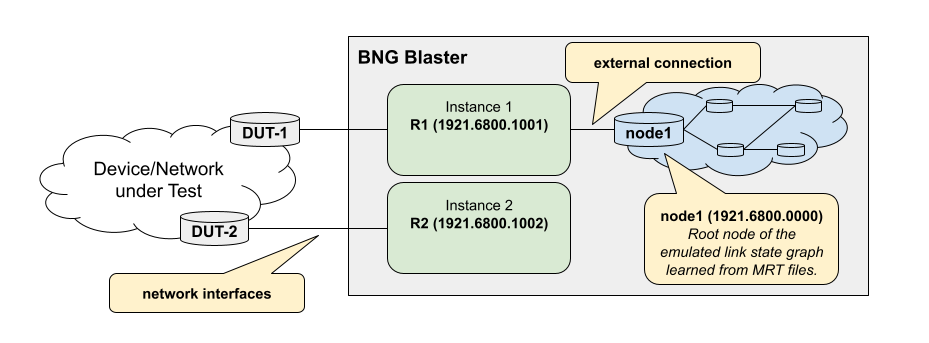

.. _isis:

ISIS
----

Intermediate System to Intermediate System (ISIS, also written IS-IS) 
is a routing protocol designed to move information efficiently within 
a network.

The ISIS protocol is defined in ISO/IEC 10589:2002 as an international 
standard within the Open Systems Interconnection (OSI) reference design. 
The Internet Engineering Task Force (IETF) republished ISIS in RFC 1142, 
but that RFC was later marked as historic by RFC 7142 because it republished 
a draft rather than a final version of the ISO standard, causing confusion.

ISIS has been called the de facto standard for a large service provider 
network backbones.

The BNG Blaster can emulate multiple ISIS instances. An ISIS instance
is a virtual ISIS node with one or more network interfaces attached. Such a
node behaves like a "real router" including database synchronization and 
flooding. Every instance generates a ``self`` originated LSP describing the
node itself.

Configuration
~~~~~~~~~~~~~

Following an example ISIS configuration with one instance 
attached to two network interfaces.

.. code-block:: json

    {
        "interfaces": {
            "network": [
                {
                    "interface": "eth1",
                    "address": "10.0.1.2/24",
                    "gateway": "10.0.1.1",
                    "address-ipv6": "fc66:1337:7331:1::2/64",
                    "gateway-ipv6": "fc66:1337:7331:1::1",
                    "isis-instance-id": 1,
                    "isis-level": 1,
                    "isis-l1-metric": 100,
                },
                {
                    "interface": "eth2",
                    "address": "10.0.2.2/24",
                    "gateway": "10.0.2.1",
                    "address-ipv6": "fc66:1337:7331:2::2/64",
                    "gateway-ipv6": "fc66:1337:7331:2::1",
                    "isis-instance-id": 1
                }
            ]
        },
        "isis": [
            {
                "instance-id": 1,
                "system-id": "0100.1001.0010",
                "router-id": "10.10.10.10",
                "hostname": "R1",
                "area": [
                    "49.0001/24",
                    "49.0002/24"
                ],
                "hello-padding": true,
                "lsp-lifetime": 65535,
                "level1-auth-key": "secret",
                "level1-auth-type": "md5",
                "sr-base": 2000,
                "sr-range": 3600
            }
        ]
    }

.. include:: ../configuration/isis.rst

The support for multiple instances allows different use cases. One example might 
be to create two instances connected to the device or network under test. Now 
inject an LSP on one instance and check if learned over the tested network on 
the other instance. 

Every ISIS instance can be also connected to an emulated link state graph loaded 
by MRT files as shown in the example below. 

.. code-block:: json

    {
        "isis": [
            {
                "instance-id": 1,
                "system-id": "0100.1001.0011",
                "router-id": "10.10.10.11",
                "hostname": "B1",
                "external": {
                    "mrt-file": "test.mrt",
                    "connections": [
                        {
                            "system-id": "0000.0000.0001",
                            "l1-metric": 1000,
                            "l2-metric": 2000
                        }
                    ]
                }
            },
            {
                "instance-id": 1,
                "system-id": "0100.1001.0011",
                "router-id": "10.10.10.12",
                "hostname": "B2"
            }
        ]
    }

.. include:: ../configuration/isis_external.rst

The node ``N1`` in this example also needs to advertise the 
reachability to node ``B1``.

.. include:: ../configuration/isis_external_connections.rst

Adjacencies
~~~~~~~~~~~

The BNG Blaster supports P2P adjacencies with 3-way-handshake only.

``$ sudo bngblaster-cli run.sock isis-adjacencies``

.. code-block:: json

    {
        "status": "ok",
        "code": 200,
        "isis-adjacencies": [
            {
                "interface": "eth1",
                "type": "P2P",
                "level": "L1",
                "instance-id": 2,
                "adjacency-state": "Up",
                "peer": {
                    "system-id": "0100.1001.0022"
                }
            },
            {
                "interface": "eth2",
                "type": "P2P",
                "level": "L1",
                "instance-id": 1,
                "adjacency-state": "Up",
                "peer": {
                    "system-id": "0100.1001.0021"
                }
            }
        ]
    }

Database
~~~~~~~~

The BNG Blaster distinguishes between three different source types of 
LSP entries in the ISIS database. 

The type ``self`` is used for the self-originated LSP describing the own 
BNG Blaster ISIS instance. LSP entries of type ``adjacency`` are learned
via ISIS adjacencies. The type ``external`` is used for those LSP entries 
learned via MRT files or injected via ``isis-lsp-update`` :ref:`command <api>`.

``$ sudo bngblaster-cli run.sock isis-database instance 1 level 1``

.. code-block:: json

    {
        "status": "ok",
        "code": 200,
        "isis-database": [
            {
                "id": "0000.0000.0001.00-00",
                "seq": 1,
                "lifetime": 65535,
                "lifetime-remaining": 65529,
                "source-type": "external"
            },
            {
                "id": "0100.1001.0011.00-00",
                "seq": 2,
                "lifetime": 65535,
                "lifetime-remaining": 65507,
                "source-type": "self"
            },
            {
                "id": "0100.1001.0021.00-00",
                "seq": 2,
                "lifetime": 65524,
                "lifetime-remaining": 65506,
                "source-type": "adjacency",
                "source-system-id": "0100.1001.0021"
            },
            {
                "id": "0100.1001.0022.00-00",
                "seq": 2,
                "lifetime": 65524,
                "lifetime-remaining": 65506,
                "source-type": "adjacency",
                "source-system-id": "0100.1001.0021"
            }
        ]
    }

The BNG Blaster automatically purges all LSPs of type
``self`` and ``external`` during teardown. This is done by
generating LSPs with newer sequence numbers and a lifetime
of 30 seconds only. This lifetime is enough to flood the purge
LSP over the whole network under test. 

Flooding
~~~~~~~~

The BNG Blaster floods LSPs received to all other active
adjacencies of the ISIS instance except to those with peer
system-id equal to the source system-id of the LSP.

Limitations
~~~~~~~~~~~

Currently, only ISIS P2P links are supported. There is also
no support for route leaking between levels. 

MRT Files
~~~~~~~~~

The BNG Blaster can load LSPs from a MRT file as defined in 
[RFC6396](https://datatracker.ietf.org/doc/html/rfc6396).

.. code-block:: none

    0                   1                   2                   3
    0 1 2 3 4 5 6 7 8 9 0 1 2 3 4 5 6 7 8 9 0 1 2 3 4 5 6 7 8 9 0 1
    +-+-+-+-+-+-+-+-+-+-+-+-+-+-+-+-+-+-+-+-+-+-+-+-+-+-+-+-+-+-+-+-+
    |                           Timestamp                           |
    +-+-+-+-+-+-+-+-+-+-+-+-+-+-+-+-+-+-+-+-+-+-+-+-+-+-+-+-+-+-+-+-+
    |             Type              |            Subtype            |
    +-+-+-+-+-+-+-+-+-+-+-+-+-+-+-+-+-+-+-+-+-+-+-+-+-+-+-+-+-+-+-+-+
    |                             Length                            |
    +-+-+-+-+-+-+-+-+-+-+-+-+-+-+-+-+-+-+-+-+-+-+-+-+-+-+-+-+-+-+-+-+
    |                      Message... (variable)
    +-+-+-+-+-+-+-+-+-+-+-+-+-+-+-+-+-+-+-+-+-+-+-+-+-+-+-+

The message field contains the complete ISIS LSP PDU including 
the ISIS common header starting with ``0x83``. 

Those files can be loaded at startup via the configuration option 
``"isis": { "external": { "mrt-file": "<file>" } }`` or alternative
via ``isis-load-mrt`` :ref:`command <api>`. 

``$ sudo bngblaster-cli run.sock isis-load-mrt file test.mrt instance 1``

LSP Update Command
~~~~~~~~~~~~~~~~~~

It is also possible to inject external LSPs using the ``isis-lsp-update``
:ref:`command <api>`. 

The :ref:`command <api>` expects a list of hex encoded PDU's including 
the ISIS common header starting with ``0x83``, 

``$ cat command.json | jq .``

.. code-block:: json

    {
        "command": "isis-lsp-update",
        "arguments": {
            "instance": 1,
            "pdu": [
                "831b0100120100000021ffff010203040506000000000003c0d103010403490001", 
                "831b0100120100000021ffff010203040506000100000003bad603010403490001"
            ]
        }
    }

LSP Update via Scapy 
~~~~~~~~~~~~~~~~~~~~

The following example shows how to generate LSPs via Scapy 
and inject them using the ``isis-lsp-update`` :ref:`command <api>`.

.. code-block:: python

    import sys
    import socket
    import os
    import json

    from scapy.contrib.isis import *

    def error(*args, **kwargs):
        """print error and exit"""
        print(*args, file=sys.stderr, **kwargs)
        sys.exit(1)

    def execute_command(socket_path, request):
        if os.path.exists(socket_path):
            client = socket.socket(socket.AF_UNIX, socket.SOCK_STREAM)
            try:
                client.connect(socket_path)
                client.send(json.dumps(request).encode('utf-8'))
                data = ""
                while True:
                    junk = client.recv(1024)
                    if junk:
                        data += junk.decode('utf-8')
                    else:
                        break
                print(json.dumps(json.loads(data), indent=4))
            except Exception as e:
                error(e)
            finally:
                client.close()
        else:
            error("socket %s not found" % socket_path)

    def main():
        """main function"""
        socket_path = sys.argv[1]

        command = {
            "command": "isis-lsp-update",
            "arguments": {
                "instance": 1, 
                "pdu": []
            }    
        }

        tlvs = ISIS_AreaTlv(areas=ISIS_AreaEntry(areaid='49.0001'))
        pdu = ISIS_CommonHdr()/ISIS_L1_LSP(lifetime=65535, lspid='0102.0304.0506.00-00', seqnum=3, tlvs=tlvs)
        command["arguments"]["pdu"].append(pdu.build().hex())

        pdu = ISIS_CommonHdr()/ISIS_L1_LSP(lifetime=65535, lspid='0102.0304.0506.00-01', seqnum=3, tlvs=tlvs)
        command["arguments"]["pdu"].append(pdu.build().hex())

        execute_command(socket_path, command)

    if __name__ == "__main__":
        main()

LSPGEN
~~~~~~

The BNG Blaster includes a tool called ``lspgen`` which is able to generate
topologies and link state packets for export as MRT and PCAP files. This tool
is also able to inject LSPs directly using the ``isis-lsp-update``
:ref:`command <api>`.

.. code-block:: none

    $ lspgen --help

        ____   __   ____         _        __            ,/
        / __ \ / /_ / __ ) _____ (_)_____ / /__        ,'/
        / /_/ // __// __  |/ ___// // ___// //_/      ,' /
    / _, _// /_ / /_/ // /   / // /__ / ,<       ,'  /_____,    
    /_/ |_| \__//_____//_/   /_/ \___//_/|_|    .'____    ,'   
        __   _____ ____  ______                      /  ,'
        / /  / ___// __ \/ ____/__  ____             / ,'
        / /   \__ \/ /_/ / / __/ _ \/ __ \           /,'
    / /______/ / ____/ /_/ /  __/ / / /          / 
    /_____/____/_/    \____/\___/_/ /_/

    Usage: lspgen [OPTIONS]

    -v --version
    -a --area <args>
    -K --authentication-key <args>
    -T --authentication-type none|simple|md5
    -r --read-config-file <args>
    -w --write-config-file <args>
    -C --connector <args>
    -S --control-socket <args>
    -l --ipv4-link-prefix <args>
    -L --ipv6-link-prefix <args>
    -n --ipv4-node-prefix <args>
    -N --ipv6-node-prefix <args>
    -x --ipv4-external-prefix <args>
    -X --ipv6-external-prefix <args>
    -M --lsp-lifetime <args>
    -z --no-ipv4
    -Z --no-ipv6
    -e --external-count <args>
    -g --graphviz-file <args>
    -h --help
    -m --mrt-file <args>
    -c --node-count <args>
    -p --pcap-file <args>
    -f --stream-file <args>
    -s --seed <args>
    -q --sequence <args>
    -V --level <args>
    -t --log normal|debug|lsp|lsdb|timer|timer-detail|ctrl|error
 

You can generate random topologies or define a topology manually 
using configuration files.

Random Topologies
^^^^^^^^^^^^^^^^^

The following example generates a random topology with 1000 nodes. 

.. code-block:: none

    lspgen -m isis.mrt -c 1000 -K <secret> -T md5

The arguments ``-K`` and ``-T`` add a valid authentication TLV
to the generated LSPs in the MRT file. 

Those topologies could be even exported as configuration file 
with the argument ``-w`` and later imported with the argument ``-r``.
This allows the generation of a large random topology that can be modified
manually. 

Topology from Configuration File
^^^^^^^^^^^^^^^^^^^^^^^^^^^^^^^^

The following example shows the configuration for a topology 
with three nodes.

.. code-block:: json

    {
        "level1": [
            {
                "node_id": "1337.0000.0001",
                "hostname": "R1",
                "area_list": [
                    "49.1337/24"
                ],
                "protocol_list": [
                    "ipv4"
                ],
                "ipv4_address_list": [
                    "10.13.37.1"
                ],
                "ipv4_prefix_list": [
                    {
                        "ipv4_prefix": "10.13.37.1/32",
                        "metric": 0,
                        "segment_id": 30005,
                        "node_flag": true
                    },
                    {
                        "ipv4_prefix": "10.0.1.0/24",
                        "metric": 1000
                    },
                    {
                        "ipv4_prefix": "10.0.2.0/24",
                        "metric": 1000
                    }
                ],
                "capability_list": [
                    {
                        "router_id": "10.13.37.1",
                        "mpls_ipv4_flag": true,
                        "mpls_ipv6_flag": false,
                        "srgb_base": 100000,
                        "srgb_range": 36000
                    }
                ],
                "neighbor_list": [
                    {
                        "remote_node_id": "1337.0000.0000.00",
                        "metric": 10
                    },
                    {
                        "remote_node_id": "1337.0000.0002.00",
                        "metric": 10
                    },
                    {
                        "remote_node_id": "0204.0000.0003.00",
                        "metric": 10
                    }
                ]
            },
            {
                "node_id": "1337.0000.0002",
                "hostname": "R2",
                "area_list": [
                    "49.1337/24"
                ],
                "protocol_list": [
                    "ipv4"
                ],
                "ipv4_address_list": [
                    "10.13.37.2"
                ],
                "ipv4_prefix_list": [
                    {
                        "ipv4_prefix": "10.13.37.2/32",
                        "metric": 0,
                        "segment_id": 30003,
                        "node_flag": true
                    }
                ],
                "capability_list": [
                    {
                        "router_id": "10.13.37.2",
                        "mpls_ipv4_flag": true,
                        "mpls_ipv6_flag": false,
                        "srgb_base": 100000,
                        "srgb_range": 36000
                    }
                ],
                "neighbor_list": [
                    {
                        "remote_node_id": "1337.0000.0001.00",
                        "metric": 10
                    }
                ]
            },
            {
                "node_id": "1337.0000.3",
                "hostname": "R3",
                "area_list": [
                    "49.1337/24"
                ],
                "protocol_list": [
                    "ipv4"
                ],
                "ipv4_address_list": [
                    "10.13.37.3"
                ],
                "ipv4_prefix_list": [
                    {
                        "ipv4_prefix": "10.13.37.3/32",
                        "metric": 0,
                        "segment_id": 30003,
                        "node_flag": true
                    }
                ],
                "capability_list": [
                    {
                        "router_id": "10.13.37.3",
                        "mpls_ipv4_flag": true,
                        "mpls_ipv6_flag": false,
                        "srgb_base": 100000,
                        "srgb_range": 36000
                    }
                ],
                "neighbor_list": [
                    {
                        "remote_node_id": "1337.0000.0001.00",
                        "metric": 10
                    }
                ]
            }
        ]
    }