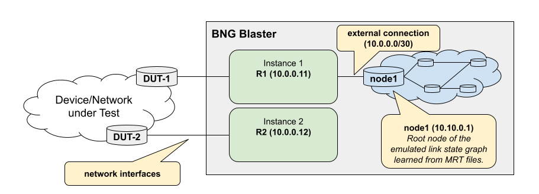

.. _ospf:

OSPF
----

OSPF (Open Shortest Path First) is a dynamic Interior Gateway Protocol (IGP) 
widely used in large computer networks. It efficiently determines the best paths 
for data transmission, adapting to network changes in real-time. OSPF's link-state 
algorithm builds a detailed network map, optimizing data delivery and 
ensuring network stability.

There are two versions of OSPF: OSPFv2 and OSPFv3. OSPFv2 is used for IPv4 networks, 
while OSPFv3 is designed specifically for IPv6 networks.

The BNG Blaster can emulate multiple OSPF instances of both versions, OSPFv2 and OSPFv3 
(OSPFv3 is basically working but still under development). 

An OSPF instance is a virtual OSPF node with one or more network interfaces attached. Such a
node behaves like a "real router" including database synchronization and  flooding. Every 
instance generates a ``self`` originated type 1 router LSA describing the node itself. 

Configuration
~~~~~~~~~~~~~

Following an example OSPFv2 configuration with two instances 
attached to two network interfaces.

.. code-block:: json

    {
        "interfaces": {
            "network": [
                {
                    "interface": "eth1",
                    "address": "10.0.1.2/30",
                    "gateway": "10.0.1.1",
                    "ospfv2-instance-id": 1,
                    "ospfv2-type": "p2p",
                },
                {
                    "interface": "eth2",
                    "address": "10.0.2.2/24",
                    "gateway": "10.0.2.1",
                    "ospfv2-instance-id": 2,
                    "ospfv2-type": "broadcast"
                }
            ]
        },
        "ospf": [
            {
                "instance-id": 1,
                "version": 2,
                "router-id": "10.0.0.11",
                "hostname": "R1"
            },
            {
                "instance-id": 2,
                "version": 2,
                "router-id": "10.0.0.12",
                "hostname": "R2"
            }
        ]
    }

.. include:: ../configuration/ospf.rst

The support for multiple instances allows different use cases. One example might 
be to create two instances connected to the device or network under test. Now 
inject an LSA on one instance and check if learned over the tested network on 
the other instance. 

Every OSPF instance can be also connected to an emulated link state graph loaded 
by MRT files as shown in the example below. 

.. code-block:: json

    {
        "ospf": [
            {
                "instance-id": 1,
                "version": 2,
                "router-id": "10.0.0.11",
                "hostname": "R1"
                "external": {
                    "mrt-file": "ospf.mrt",
                    "connections": [
                        {
                            "router-id": "10.10.0.1",
                            "local-ipv4-address": "10.0.0.1",
                            "metric": 1000
                        }
                    ]
                }
            }
        ]
    }

.. include:: ../configuration/ospf_external.rst
.. include:: ../configuration/ospf_external_connections.rst

Interfaces
~~~~~~~~~~~

The BNG Blaster supports P2P and broadcast interfaces only.

The following command returns detailed informations about all
OSPF interfaces associated with the given OSPF instance (e.g. instance 1).

``$ sudo bngblaster-cli run.sock ospf-interfaces instance 1``

Neighbors
~~~~~~~~~

The following command returns detailed informations about all
OSPF neighbors associated with the given OSPF instance (e.g. instance 1).

``$ sudo bngblaster-cli run.sock ospf-neighbors instance 1``

Database
~~~~~~~~

The BNG Blaster distinguishes between three different source types of 
LSA entries in the OSPF database. 

The type ``self`` is used for the self-originated LSA describing the own 
BNG Blaster OSPF instance. LSP entries of type ``adjacency`` are learned
from OSPF neighbors. The type ``external`` is used for those LSA entries 
learned via MRT files or injected via ``ospf-lsa/pdu-update`` :ref:`command <api>`.

``$ sudo bngblaster-cli run.sock ospf-database instance 1``

The BNG Blaster automatically purges all LSAs of type
``self`` and ``external`` during teardown. This is done by
generating LSAs with newer sequence numbers and max age. 

Flooding
~~~~~~~~

The BNG Blaster floods LSAs received to all other active
neighbors of the OSPF instance except to those with neighbor
router-id equal to the source router-id of the LSA.

LSA Update Command
~~~~~~~~~~~~~~~~~~

It is also possible to inject LSAs using the ``ospf-lsa-update`` :ref:`command <api>`.

This :ref:`command <api>` expects a list of hex encoded LSA including 
the OSPF LSA common header (``| LS age | Options | LS type |``). 

``$ cat command.json | jq .``

.. code-block:: json

    {
        "command": "ospf-lsa-update",
        "arguments": {
            "instance": 1,
            "lsa": [
                "000100050ac801000aff010180000001e7790024ffffff00000000140000000000000000",
                "000100050ac802000aff010180000001dc830024ffffff00000000140000000000000000"
            ]
        }
    }

The command ``ospf-pdu-update`` work similar to ``ospf-lsa-update`` expecting OSPF LS update 
request PDU including OSPF common header  (``| Version | Type |``). 

.. code-block:: json

    {
        "command": "ospf-pdu-update",
        "arguments": {
            "instance": 1,
            "pdu": [
                "020400400101010100000000456e0000000000000000000000000001000100050ac80c000aff01018000012d13160024ffffff00000000140000000000000000",
                "0204004001010101000000003b780000000000000000000000000001000100050ac80b000aff01018000012d1e0c0024ffffff00000000140000000000000000"
            ]
        }
    }

LSA Update via Scapy
~~~~~~~~~~~~~~~~~~~~

The following example shows how to generate LSAs via Scapy 
and inject them using the ospf-lsa-update :ref:`command <api>`.

.. code-block:: python

    import sys
    import socket
    import os
    import json

    from scapy.contrib.ospf import *

    def error(*args, **kwargs):
        """print error and exit"""
        print(*args, file=sys.stderr, **kwargs)
        sys.exit(1)

    def execute_command(socket_path, request):
        if os.path.exists(socket_path):
            client = socket.socket(socket.AF_UNIX, socket.SOCK_STREAM)
            try:
                client.connect(socket_path)
                client.send(json.dumps(request).encode('utf-8'))
                data = ""
                while True:
                    junk = client.recv(1024)
                    if junk:
                        data += junk.decode('utf-8')
                    else:
                        break
                print(json.dumps(json.loads(data), indent=4))
            except Exception as e:
                error(e)
            finally:
                client.close()
        else:
            error("socket %s not found" % socket_path)

    def main():
        """main function"""
        socket_path = sys.argv[1]

        command = {
            "command": "ospf-lsa-update",
            "arguments": {
                "instance": 1, 
                "lsa": []
            }    
        }

        lsa = OSPF_External_LSA(type=5, id="10.200.1.0", adrouter="10.255.1.1", mask="255.255.255.0", seq=2147483649)
        command["arguments"]["lsa"].append(lsa.build().hex())

        lsa = OSPF_External_LSA(type=5, id="10.200.2.0", adrouter="10.255.1.1", mask="255.255.255.0", seq=2147483649)
        command["arguments"]["lsa"].append(lsa.build().hex())

        execute_command(socket_path, command)

    if __name__ == "__main__":
        main()

MRT Files
~~~~~~~~~

The BNG Blaster can load LSA updates from a MRT file as defined in 
`RFC6396 <https://datatracker.ietf.org/doc/html/rfc6396>`_.

.. code-block:: none

    0                   1                   2                   3
    0 1 2 3 4 5 6 7 8 9 0 1 2 3 4 5 6 7 8 9 0 1 2 3 4 5 6 7 8 9 0 1
    +-+-+-+-+-+-+-+-+-+-+-+-+-+-+-+-+-+-+-+-+-+-+-+-+-+-+-+-+-+-+-+-+
    |                           Timestamp                           |
    +-+-+-+-+-+-+-+-+-+-+-+-+-+-+-+-+-+-+-+-+-+-+-+-+-+-+-+-+-+-+-+-+
    |             Type              |            Subtype            |
    +-+-+-+-+-+-+-+-+-+-+-+-+-+-+-+-+-+-+-+-+-+-+-+-+-+-+-+-+-+-+-+-+
    |                             Length                            |
    +-+-+-+-+-+-+-+-+-+-+-+-+-+-+-+-+-+-+-+-+-+-+-+-+-+-+-+-+-+-+-+-+
    |                      Message... (variable)
    +-+-+-+-+-+-+-+-+-+-+-+-+-+-+-+-+-+-+-+-+-+-+-+-+-+-+-+

The message field contains the complete OSPF LS Update PDU including 
the OSPF common header starting with version field. 

Those files can be loaded at startup via the configuration option 
``"ospf": { "external": { "mrt-file": "<file>" } }`` or alternative
via ``ospf-load-mrt`` :ref:`command <api>`. 

``$ sudo bngblaster-cli run.sock ospf-load-mrt file ospf.mrt instance 1``

The following example shows how to generate such MRT file via Scapy.

.. code-block:: python

    import struct
    from scapy.contrib.ospf import *

    def main():
        """main function"""
        with open("ospf.mrt", "wb") as f:
            for i in range(10):
                lsa = OSPF_External_LSA(type=5, id="10.222.%s.0" % i, adrouter="10.255.1.1", mask="255.255.255.0", seq=2147483949)
                ospf = OSPF_Hdr()/OSPF_LSUpd(lsacount=1)/lsa
                pdu = struct.pack("!II", 0, 0) + ospf.build()
                mrt = struct.pack("!IHHI", 0, 11, 0, len(pdu)) + pdu
                f.write(mrt)

    if __name__ == "__main__":
        main()

LSPGEN
~~~~~~

The BNG Blaster includes a tool called :ref:`lspgen <lspgen>`, which is able to generate
topologies and link state packets for export as MRT and PCAP files. This tool
is also able to inject LSAs directly using the ``ospf-pdu-update``
:ref:`command <api>`.

OSPFv3
~~~~~~

The BNG Blaster also provides support for OSPFv3, although it should be noted that 
its support, compared to OSPFv2, is still considered experimental.

Conceptually, OSPFv2 and OSPFv3 function the same way in the BNG Blaster, and the 
basic configuration differs only in the version number. The control commands are 
also identical.

.. code-block:: json

    {
        "interfaces": {
            "network": [
                {
                    "interface": "eth1",
                    "address-ipv6": "fc66:1337:60::2/64",
                    "gateway-ipv6": "fc66:1337:60::1",
                    "ospfv3-instance-id": 1,
                    "ospfv3-type": "p2p"
                }
            ]
        },
        "ospf": [
            {
                "instance-id": 1,
                "version": 3,
                "router-id": "10.0.0.16",
                "hostname": "R6"
            }
        ]
    }