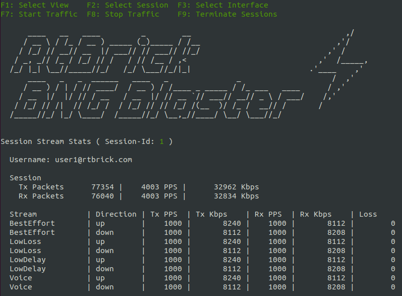

.. _streams:

Traffic Streams
===============

The BNG Blaster can perform various forwarding verifications
and QoS tests using traffic streams. 

Traffic streams can be either bounded or RAW. Bounded streams 
are associated with an access configuration that specifies the 
session parameters, such as protocols and encapsulations. Those 
streams are instantiated per session and get their addresses
automatically from the sessions that they belong to. 

RAW streams are linked to :ref:`network interfaces <network-interface>` 
that provide the source addresses unless they are manually set.

It is also possible to create traffic streams on :ref:`network interfaces <network-interface>` 
to or from destinations associated with certain emulated routing topologies. For instance, 
you can emulate an ISIS network, advertise BGP prefixes with next-hops in this 
emulated ISIS network, and then send traffic to or from one of those BGP prefixes.

Understanding Flows
~~~~~~~~~~~~~~~~~~~

A flow represents a particular instance of a traffic stream where a stream 
can consist of one or more flows, depending on its configuration 
and the number of sessions it is associated with. For example:

+ A unidirectional stream is represented by a single flow that sends or receives traffic from one end to another
+ A bidirectional stream is represented by two flows that send and receive traffic in opposite directions
+ A stream that is bound by sessions can be instantiated multiple times for each session and direction

Each flow can be identified by its flow-id, which is a unique number automatically 
assigned by the BNG Blaster.

.. image:: images/bbl_flows.png
    :alt: BNG Blaster Traffic Flows

You can use the ``stream-info flow-id <id>`` command to get detailed information about a specific flow, 
such as its configuration, statistics, and state. You can also use the ``stream-summary`` command to get a 
brief overview of all the flows that are currently active or configured.

Configuration
~~~~~~~~~~~~~

Following a simple PPPoE example with streams. 

.. code-block:: json

    {
        "interfaces": {
            "network": {
                "interface": "eth2",
                "address": "10.0.0.1/24",
                "gateway": "10.0.0.2",
                "address-ipv6": "fc66:1337:7331::1/64",
                "gateway-ipv6": "fc66:1337:7331::2"
            },
            "access": [
            {
                "interface": "eth1",
                "outer-vlan-min": 1001,
                "outer-vlan-max": 2000,
                "inner-vlan-min": 7,
                "inner-vlan-max": 7,
                "type": "pppoe",
                "stream-group-id": 1
            },
            {
                "interface": "eth1",
                "outer-vlan-min": 2001,
                "outer-vlan-max": 4000,
                "inner-vlan": 7,
                "type": "pppoe",
                "stream-group-id": 2
            }
        ]
        },
        "streams": [
            {
                "name": "BestEffort",
                "stream-group-id": 1,
                "type": "ipv4",
                "direction": "both",
                "pps": 1000
            },
            {
                "name": "Voice",
                "stream-group-id": 1,
                "type": "ipv4",
                "direction": "downstream",
                "priority": 128,
                "vlan-priority": 2,
                "network-ipv4-address": "10.0.0.10",
                "pps": 100
            },
            {
                "name": "BestEffort",
                "stream-group-id": 2,
                "type": "ipv4",
                "direction": "both",
                "pps": 1
            }
        ]
    }

.. include:: configuration/streams.rst

Stream Configuration File
~~~~~~~~~~~~~~~~~~~~~~~~~

The command line argument ``-T <filename>`` allows the include
of streams defined in a separate file. The format is equal to
streams defined in the actual configuration file. Such stream
configuration files could be generated by scripts and
easily merged with the base configuration.

.. code-block:: json

    {
        "streams": []
    }

RAW Streams
~~~~~~~~~~~

Streams with default ``stream-group-id`` set to zero are considered raw streams not
bound to any session which is supported downstream only. For those streams, the
destination address must be explicitly set.

RAW streams can be used for traffic between network interfaces but also to send traffic
from network to access interfaces.

.. code-block:: json

    {
        "streams": [
            {
                "name": "RAW",
                "type": "ipv4",
                "direction": "downstream",
                "priority": 128,
                "network-ipv4-address": "10.0.0.20",
                "destination-ipv4-address": "1.1.1.1",
                "length": 256,
                "pps": 1
            }
        ]
    }

If ``destination-ipv4-address`` is set to a multicast IP address (224.0.0.0 - 239.255.255.255),
the BNG Blaster will set the destination MAC address to the corresponding
multicast MAC address automatically. For unicast traffic the network gateway MAC address is used.

TCP RAW Streams
~~~~~~~~~~~~~~~

A new option called ``raw-tcp`` is added to the stream configuraton. 
If enabled, UDP-like traffic with a constant rate is sent using a 
static (RAW) TCP header.

.. code-block:: json

    {
        "streams": [
            {
                "name": "TCP1",
                "stream-group-id": 1,
                "type": "ipv4",
                "direction": "both",
                "pps": 1,
                "raw-tcp": true,
                "network-ipv4-address": "10.0.0.1"
            }
        ]
    }

This option can be used stand-alone to verify firewall filters or together 
with the new NAT option to verify NAT TCP streams. 

For now, TCP flags (SYN, …) are statically set to SYN but this could be adopted if needed.

Stream Commands
~~~~~~~~~~~~~~~

The BNG Blaster provides multiple commands to control and check traffic streams. 
The command ``stream-summary`` returns a list of all flows with terse informations. 
This list can be optionally filtered using different arguments like session-group-id, 
name, interface and direction. This summary output can be used to identify the actual 
flow-id of a particular stream to query detailed informations using 
the ``stream-info flow-id <id>`` command. 

The ``session-streams`` command returns detailed stream statistics per session.

``$ sudo bngblaster-cli run.sock session-streams session-id 1``

.. code-block:: json

    {
        "status": "ok",
        "code": 200,
        "session-streams": {
            "session-id": 1,
            "rx-packets": 59670,
            "tx-packets": 54610,
            "rx-accounting-packets": 59655,
            "tx-accounting-packets": 54594,
            "rx-pps": 1100,
            "tx-pps": 1000,
            "rx-bps-l2": 9028800,
            "tx-bps-l2": 8240000,
            "rx-mbps-l2": 9.0288,
            "tx-mbps-l2": 8.24,
            "streams": [
                {
                    "name": "BestEffort",
                    "direction": "upstream",
                    "flow-id": 1,
                    "rx-first-seq": 362,
                    "rx-last-seq": 54593,
                    "rx-tos-tc": 0,
                    "rx-outer-vlan-pbit": 0,
                    "rx-inner-vlan-pbit": 0,
                    "rx-len": 1014,
                    "tx-len": 1030,
                    "rx-packets": 54232,
                    "tx-packets": 54594,
                    "rx-loss": 0,
                    "rx-delay-us-min": 37,
                    "rx-delay-us-max": 98595,
                    "rx-pps": 1000,
                    "tx-pps": 1000,
                    "tx-bps-l2": 8240000,
                    "rx-bps-l2": 8112000,
                    "rx-bps-l3": 8000000,
                    "tx-mbps-l2": 8.24,
                    "rx-mbps-l2": 8.112,
                    "rx-mbps-l3": 8.0
                },
                {
                    "name": "BestEffort",
                    "direction": "downstream",
                    "flow-id": 2,
                    "rx-first-seq": 362,
                    "rx-last-seq": 54593,
                    "rx-tos-tc": 0,
                    "rx-outer-vlan-pbit": 0,
                    "rx-inner-vlan-pbit": 0,
                    "rx-len": 1026,
                    "tx-len": 1014,
                    "rx-packets": 54232,
                    "tx-packets": 54594,
                    "rx-loss": 0,
                    "rx-delay-us-min": 43,
                    "rx-delay-us-max": 98903,
                    "rx-pps": 1000,
                    "tx-pps": 1000,
                    "tx-bps-l2": 8112000,
                    "rx-bps-l2": 8208000,
                    "rx-bps-l3": 8000000,
                    "tx-mbps-l2": 8.112,
                    "rx-mbps-l2": 8.208,
                    "rx-mbps-l3": 8.0
                },
                {
                    "name": "Voice",
                    "direction": "downstream",
                    "flow-id": 3,
                    "rx-first-seq": 37,
                    "rx-last-seq": 5458,
                    "rx-tos-tc": 128,
                    "rx-outer-vlan-pbit": 0,
                    "rx-inner-vlan-pbit": 0,
                    "rx-len": 1026,
                    "tx-len": 1014,
                    "rx-packets": 5422,
                    "tx-packets": 5458,
                    "rx-loss": 0,
                    "rx-delay-us-min": 41,
                    "rx-delay-us-max": 96548,
                    "rx-pps": 100,
                    "tx-pps": 100,
                    "tx-bps-l2": 811200,
                    "rx-bps-l2": 820800,
                    "rx-bps-l3": 800000,
                    "tx-mbps-l2": 0.8112,
                    "rx-mbps-l2": 0.8208,
                    "rx-mbps-l3": 0.8
                }
            ]
        }
    }

The ``rx-outer-vlan-pbit`` might be wrong depending on the network interface driver and
optional VLAN offloading.

The measured ``rx-delay-us-min/max`` shows the minimum and maximum calculated delay
in microseconds. The delay is calculated by subtracting the send and receive timestamp.
The send timestamp is stored in the BBL header (see section Traffic). This calculated
result depends also on the actual test environment, configured rx-interval and host IO
delay.

Traffic streams will start as soon as the session is established using the rate as configured
starting with sequence number 1 for each flow. The attribute ``rx-first-seq`` stores the first
sequence number received. Assuming the first sequence number received for a given flow is 1000
combined with a rate of 1000 PPS would mean that it took around 1 second until forwarding is
working. After the first packet is received for a given flow, for every further packet it checks
if there is a gap between the last and new sequence number which is then reported as a loss.

The ``rx/tx-accounting-packets`` are all packets that should be counted in the session volume
accounting of the BNG, meaning session RX/TX packets excluding control traffic.

Each flow can be queried separately using jsonpath expression with name and direction or flow-id.

.. code-block:: none

    $ sudo bngblaster-cli run.sock session-streams session-id 1 | jq '."session-streams".streams[] | select(.name == "BE" and .direction == "downstream" )'

.. code-block:: json

    {
        "name": "BE",
        "direction": "downstream",
        "flow-id": 2,
        "rx-first-seq": 33,
        "rx-last-seq": 27040,
        "rx-tos-tc": 213,
        "rx-outer-vlan-pbit": 0,
        "rx-inner-vlan-pbit": 0,
        "rx-len": 126,
        "tx-len": 114,
        "rx-packets": 27008,
        "tx-packets": 27040,
        "rx-loss": 0,
        "rx-delay-us-min": 50,
        "rx-delay-us-max": 10561,
        "rx-pps": 99,
        "tx-pps": 99,
        "tx-bps-l2": 90288,
        "rx-bps-l2": 99792,
        "rx-bps-l3": 79200,
        "tx-mbps-l2": 0.090288,
        "rx-mbps-l2": 0.099792,
        "rx-mbps-l3": 0.0792
    }

Start/Stop Traffic
~~~~~~~~~~~~~~~~~~

The BNG Blaster provides multiple options to start, stop and autostart traffic streams
which are divided into two parts. The global traffic state and the flow state. 

The global traffic state determines whether any traffic stream can be sent or not. 
The flow state is a property of each flow that indicates whether it is enabled or disabled. 

Before sending a packet, the BNG Blaster performs several checks to ensure that the 
flow is ready to send. These checks include:

- The global traffic state must be enabled.
- The flow state must be enabled.
- The TX interface for the flow must be up.
- The endpoint for the flow must be active (e.g. PPPoE session still established).

The global traffic state can be changed by multiple methods like the configuration 
parameter ``{ "traffic": { "autostart": true/false } }``, the commands ``traffic-start/stop``, 
and the keyboard shortcuts `F7/F8`. All these methods have the same effect of setting 
the global traffic state. 

The flow state can be changed by different configurations and commands, depending on the traffic type. 
There are three types of traffic: unicast-streams, multicast-streams, and session-traffic.

The configuration section ``{"streams": []}`` defines two kinds of streams: unicast or multicast. 
The destination IP address determines the stream type: multicast IP means multicast stream, 
otherwise unicast stream. The configuration ``{"traffic": {"stream-autostart": true/false}}`` 
and ``{"traffic": {"multicast-autostart": true/false}}`` control the initial state of unicast 
and multicast streams, respectively. The commands ``stream-start/stop`` 
and ``multicast-traffic-start/stop`` can modify the state of these streams at any time.

``$ sudo bngblaster-cli run.sock stream-start session-group-id 1 direction upstream``

The configuration ``{"session-traffic": []}`` defines another kind of stream called :ref:`session-traffic <session-traffic>`. 
The configuration ``{"session-traffic": {"autostart": true/false}}`` controls the initial state 
of :ref:`session-traffic <session-traffic>`. The commands ``session-traffic-start/stop`` 
can modify the state of these streams at any time.

``$ sudo bngblaster-cli run.sock session-traffic-start session-id 1``

Details about all commands and their arguments can found int the :ref:`API/CLI <api>` section. 

Fragmentation
~~~~~~~~~~~~~

The BNG Blaster offers optional support for reassembling fragmented IPv4 traffic streams. 
This reassembly feature is currently limited to access and network interfaces and is specifically 
designed for BNG Blaster stream traffic. While the BNG Blaster does not fragment packets itself, 
it can reassemble packets fragmented by the device under test if the feature is enabled.

The following configuration is necessary to enable the reassembly of fragmented IPv4 traffic streams:

.. code-block:: json

    {
        "traffic": {
            "reassemble-fragments": true
        }
    }

The stream-info command returns the field ``rx-fragments``, which tracks the number of fragments 
used to reassemble a packet. This value has a minimum of 2, as fragmented packets consist of at 
least two fragments. Typically, it ranges between 2 and 3. 

Another field, ``rx-fragment-offset``, indicates the largest offset value among all fragments. 
This value, when added to the size of the IPv4 header, should always be less than or equal to 
the configured MTU.

.. code-block:: none

    $ sudo bngblaster-cli run.sock stream-info flow-id 1
    {
        "status": "ok",
        "code": 200,
        "stream-info": {
            "flow-id": 1,
            ...
            "rx-fragments": 2,
            "rx-fragment-offset": 1472, <<<< 1472 + 20 byte IPv4 header == 1492 (MTU)
            ...
        }
    }

.. _bbl_header:

BNG Blaster Traffic
~~~~~~~~~~~~~~~~~~~

*Blaster Header and Fast Decode Signature*

The 48 Byte fixed size BNG Blaster Header is added to all data packets
for traffic validation and fast decoding. The header is expected on the
last 48 bytes of the packet.

The type is set to 1 for all unicast session traffic and 2 for
IPv4 multicast traffic.

Unicast Session Traffic
^^^^^^^^^^^^^^^^^^^^^^^

The 64-bit session key is used for all traffic from access (upstream)
and to access (downstream) interfaces to identify the corresponding
session which has sent or should receive the packet.

.. code-block:: none

    0 1 2 3 4 5 6 7 8 9 0 1 2 3 4 5 6 7 8 9 0 1 2 3 4 5 6 7 8 9 0 1
    +-+-+-+-+-+-+-+-+-+-+-+-+-+-+-+-+-+-+-+-+-+-+-+-+-+-+-+-+-+-+-+-+
    | BNG Blaster Magic Sequence                                    |
    |                                                               |
    +-+-+-+-+-+-+-+-+-+-+-+-+-+-+-+-+-+-+-+-+-+-+-+-+-+-+-+-+-+-+-+-+
    | Type          | Sub-Type      | Direction     | TX TOS        |
    +-+-+-+-+-+-+-+-+-+-+-+-+-+-+-+-+-+-+-+-+-+-+-+-+-+-+-+-+-+-+-+-+
    | Session Identifier                                            |
    +-+-+-+-+-+-+-+-+-+-+-+-+-+-+-+-+-+-+-+-+-+-+-+-+-+-+-+-+-+-+-+-+
    | Session Access Interface Index                                |
    +-+-+-+-+-+-+-+-+-+-+-+-+-+-+-+-+-+-+-+-+-+-+-+-+-+-+-+-+-+-+-+-+
    | Session Outer VLAN            | Session Inner VLAN            |
    +-+-+-+-+-+-+-+-+-+-+-+-+-+-+-+-+-+-+-+-+-+-+-+-+-+-+-+-+-+-+-+-+
    | Flow Identifier                                               |
    |                                                               |
    +-+-+-+-+-+-+-+-+-+-+-+-+-+-+-+-+-+-+-+-+-+-+-+-+-+-+-+-+-+-+-+-+
    | Flow Sequence Number                                          |
    |                                                               |
    +-+-+-+-+-+-+-+-+-+-+-+-+-+-+-+-+-+-+-+-+-+-+-+-+-+-+-+-+-+-+-+-+
    | Nanosecond Send Timestamp                                     |
    |                                                               |
    +-+-+-+-+-+-+-+-+-+-+-+-+-+-+-+-+-+-+-+-+-+-+-+-+-+-+-+-+-+-+-+-+

.. image:: images/bbl_header.png
    :alt: BNG Blaster Header

Multicast Traffic
^^^^^^^^^^^^^^^^^

.. code-block:: none

    0 1 2 3 4 5 6 7 8 9 0 1 2 3 4 5 6 7 8 9 0 1 2 3 4 5 6 7 8 9 0 1
    +-+-+-+-+-+-+-+-+-+-+-+-+-+-+-+-+-+-+-+-+-+-+-+-+-+-+-+-+-+-+-+-+
    | BNG Blaster Magic Sequence                                    |
    |                                                               |
    +-+-+-+-+-+-+-+-+-+-+-+-+-+-+-+-+-+-+-+-+-+-+-+-+-+-+-+-+-+-+-+-+
    | Type          | Sub-Type      | Direction     | TX TOS        |
    +-+-+-+-+-+-+-+-+-+-+-+-+-+-+-+-+-+-+-+-+-+-+-+-+-+-+-+-+-+-+-+-+
    | Reserved                                                      |
    +-+-+-+-+-+-+-+-+-+-+-+-+-+-+-+-+-+-+-+-+-+-+-+-+-+-+-+-+-+-+-+-+
    | Source                                                        |
    +-+-+-+-+-+-+-+-+-+-+-+-+-+-+-+-+-+-+-+-+-+-+-+-+-+-+-+-+-+-+-+-+
    | Group                                                         |
    +-+-+-+-+-+-+-+-+-+-+-+-+-+-+-+-+-+-+-+-+-+-+-+-+-+-+-+-+-+-+-+-+
    | Flow Identifier                                               |
    |                                                               |
    +-+-+-+-+-+-+-+-+-+-+-+-+-+-+-+-+-+-+-+-+-+-+-+-+-+-+-+-+-+-+-+-+
    | Flow Sequence Number                                          |
    |                                                               |
    +-+-+-+-+-+-+-+-+-+-+-+-+-+-+-+-+-+-+-+-+-+-+-+-+-+-+-+-+-+-+-+-+
    | Nanosecond Send Timestamp                                     |
    |                                                               |
    +-+-+-+-+-+-+-+-+-+-+-+-+-+-+-+-+-+-+-+-+-+-+-+-+-+-+-+-+-+-+-+-+

.. note:: 
    All attributes except IP addresses in the Blaster Header are
    stored in host byte order for faster processing
    (LE or BE depending on the test system).

BNG Blaster Magic Sequence
^^^^^^^^^^^^^^^^^^^^^^^^^^

The 64-bit magic sequence is the word ``RtBrick!`` decoded as ASCII:

.. code-block:: none

    0x5274427269636b21

Storing the magic number on a fixed offset allows fast identification 
of blaster traffic. 

Flow Identifier
^^^^^^^^^^^^^^^

The 64-bit flow identifier is a globally unique number that identifies
the flow.

Flow Sequence Number
^^^^^^^^^^^^^^^^^^^^

The 64-bit flow sequence number is a sequential number starting with 1
and incremented per packet primary used to identify packet loss.

This number 0 means that sequencing is disabled.

Nanosecond Send Timestamps
^^^^^^^^^^^^^^^^^^^^^^^^^^

The 64-bit nanoseconds send timestamp is used for optional latency and
jitter calculations.

.. code-block:: none

    0 1 2 3 4 5 6 7 8 9 0 1 2 3 4 5 6 7 8 9 0 1 2 3 4 5 6 7 8 9 0 1
    +-+-+-+-+-+-+-+-+-+-+-+-+-+-+-+-+-+-+-+-+-+-+-+-+-+-+-+-+-+-+-+-+
    | Seconds                                                       |
    +-+-+-+-+-+-+-+-+-+-+-+-+-+-+-+-+-+-+-+-+-+-+-+-+-+-+-+-+-+-+-+-+
    | Nano Seconds                                                  |
    +-+-+-+-+-+-+-+-+-+-+-+-+-+-+-+-+-+-+-+-+-+-+-+-+-+-+-+-+-+-+-+-+

The timestamp 0 means that timestamps are disabled.